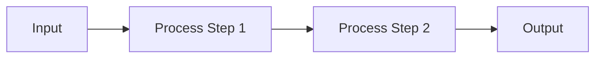

# Feature — Lightweight Feature Specification

Generate a concise, implementation-ready feature specification that serves as the input contract for code-forge:plan.

## Core Principles

1. **Concise over comprehensive**: 1-3 pages, not 20. Enough for a developer to plan implementation, not enough for a full architecture review.
2. **Language-agnostic**: Describe behavior, interfaces, and constraints — not Pydantic models or TypeBox schemas.
3. **Implementation-ready**: Every section should help code-forge:plan generate concrete tasks.
4. **Single module focus**: One feature spec per module or cohesive component. If scope spans multiple modules, suggest running `/spec-forge:decompose` first.
5. **Two sources of truth**: Can be created from scratch via Q&A, or extracted from an existing tech-design.

## Output Location

```
docs/features/{feature-name}.md
```

where `{feature-name}` is a lowercase, kebab-case slug (e.g., `core-executor`, `schema-system`, `acl-system`).

If the `docs/features/` directory does not exist, create it.

## Workflow

### Step 1: Detect Mode

Parse the feature name from arguments. Then determine the mode:

1. **Check for existing feature spec**: If `docs/features/{feature-name}.md` already exists:
   - Display: "Feature spec already exists at docs/features/{feature-name}.md"
   - Use `AskUserQuestion`:
     - "Update existing spec" — read current file as context, proceed to Q&A with existing content pre-loaded
     - "Regenerate from scratch" — proceed as if no file exists
     - "Cancel"

2. **Check for upstream tech-design**: Scan for `docs/{feature-name}/tech-design.md` or `docs/*/tech-design.md` that covers this feature.
   - **Found** → **Extract mode** (Step 2a)
   - **Not found** → **Standalone mode** (Step 2b)

3. If upstream tech-design is found, ask the user:
   - "Extract from tech-design (Recommended)" — faster, ensures consistency with formal specs
   - "Create from scratch" — ignore existing tech-design, do fresh Q&A
   - "Cancel"

### Step 2a: Extract Mode (from Tech Design)

Read the upstream `docs/{feature-name}/tech-design.md` (or the matched tech-design file).

#### 2a.1 Scan and Extract

Extract these elements from the tech-design:
- Module purpose and scope
- Key components and their responsibilities
- Core interfaces (public API surface, not internal details)
- Data flow (input → processing → output)
- Dependencies on other modules
- Constraints and invariants
- Error handling strategy (summary, not full taxonomy)

#### 2a.2 Confirm with User

Present a brief summary of what was extracted. Use `AskUserQuestion` (0-1 questions):
- "Anything to add or change?" with options:
  - "Looks good, generate" — proceed
  - "Add notes" — user provides additional context
  - "Cancel"

#### 2a.3 Generate

Write the feature spec to `docs/features/{feature-name}.md` using the template below. Skip to Step 4.

### Step 2b: Standalone Mode (Q&A)

No upstream tech-design found. Gather requirements through a brief interview.

#### 2b.1 Read Context

1. Glob the project tree (top 3 levels) for structure awareness
2. Read README.md if it exists
3. Scan `docs/` for related documents (PRD, SRS, other feature specs)
4. Scan existing code if the module partially exists

Summarize context internally — do not present to user.

#### 2b.2 Interview (2-3 rounds)

Use `AskUserQuestion` to understand the feature. Adapt based on answers.

**Round 1 — Purpose and Scope:**
- What does this module/component do? (one paragraph)
- What are its core responsibilities? (3-5 bullet points)
- What is explicitly out of scope?

**Round 2 — Interfaces and Data:**
- What does it receive as input? From whom?
- What does it produce as output? For whom?
- What external systems or modules does it depend on?
- Are there key data structures or models involved?

**Round 3 — Constraints (if needed):**
- Performance requirements? (throughput, latency)
- Security or access control requirements?
- Concurrency or ordering guarantees?
- Any hard constraints from the protocol or spec layer?

Stop when you have enough to write a clear feature spec. Do NOT over-interview — 2 rounds is often sufficient.

### Step 3: Generate Feature Spec

Write the document to `docs/features/{feature-name}.md` using the template below.

### Step 4: Quality Check

Verify the generated feature spec against these criteria:

- [ ] **Purpose is clear**: A developer can understand what this module does in 30 seconds
- [ ] **Scope is bounded**: What's included AND what's excluded is explicit
- [ ] **Interfaces are defined**: Inputs, outputs, and dependencies are listed
- [ ] **Language-agnostic**: No language-specific types, libraries, or patterns
- [ ] **Actionable**: code-forge:plan could generate implementation tasks from this
- [ ] **Concise**: Under 3 pages / ~150 lines

Fix any issues before presenting.

### Step 5: Summary

Display:

```
Feature spec generated: {feature-name}
  Location: docs/features/{feature-name}.md
  Source: {extracted from tech-design | standalone Q&A}
  Length: {line count} lines

Next steps:
  /code-forge:plan @docs/features/{feature-name}.md   → Generate implementation plan
  /spec-forge:tech-design {feature-name}               → Generate full technical design (if needed)
```

## Feature Spec Template

```markdown
# {Feature Name}

> Feature spec for code-forge implementation planning.
> Source: {standalone | extracted from docs/{name}/tech-design.md}
> Created: {date}

## Purpose

{One paragraph describing what this module does and why it exists.}

## Scope

**Included:**
- {responsibility 1}
- {responsibility 2}
- ...

**Excluded:**
- {explicitly out of scope item 1}
- ...

## Core Responsibilities

1. **{Responsibility name}** — {brief description of what it does}
2. **{Responsibility name}** — {brief description}
3. ...

## Interfaces

### Inputs
- **{input name}** ({source}) — {description}
- ...

### Outputs
- **{output name}** ({destination}) — {description}
- ...

### Dependencies
- **{module/system name}** — {what it provides and why it's needed}
- ...

## Data Flow

{Describe the main processing pipeline or data flow. Use a mermaid diagram if the flow has 3+ steps:}



## Key Behaviors

{Describe the important behavioral rules, algorithms, or processing logic. Focus on WHAT happens, not HOW to implement it.}

### {Behavior 1}
{Description}

### {Behavior 2}
{Description}

## Constraints

- **{constraint type}**: {description}
- ...

## Error Handling

{Summary of error categories and expected behavior. Not a full error taxonomy — just enough to guide implementation.}

## Notes

{Any additional context, open questions, or references to related documents.}
```

## Relationship to Other spec-forge Documents

| Document | Relationship |
|----------|-------------|
| **PRD** | Feature spec may reference PRD requirements but does not duplicate them |
| **SRS** | Feature spec is less formal — no requirement IDs, no CRUD matrix |
| **Tech Design** | Feature spec is a condensed derivative; tech-design is the authoritative source |
| **Test Plan** | Feature spec does not cover testing strategy |
| **Decompose** | If a project is decomposed, each sub-feature can have its own feature spec |

## When to Use This vs Tech Design

| Scenario | Use |
|----------|-----|
| Quick module planning, daily development | `/spec-forge:feature` |
| Formal architecture review, team alignment | `/spec-forge:tech-design` |
| Full project specification chain | `/spec-forge <name>` (includes tech-design) |
| Already have tech-design, need implementation input | `/spec-forge:feature` (extract mode) |
