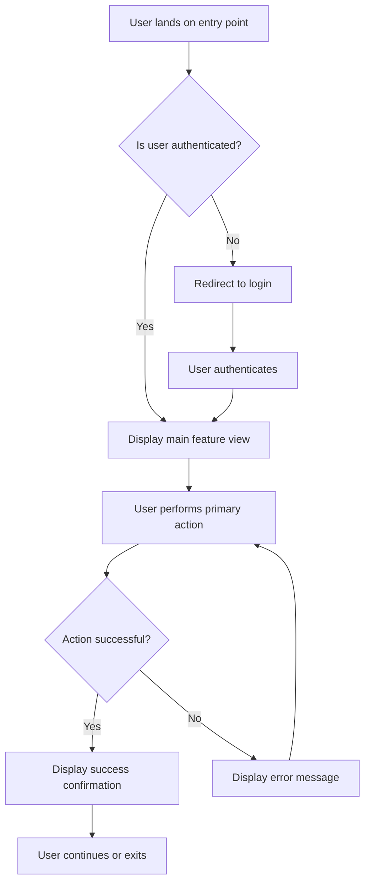
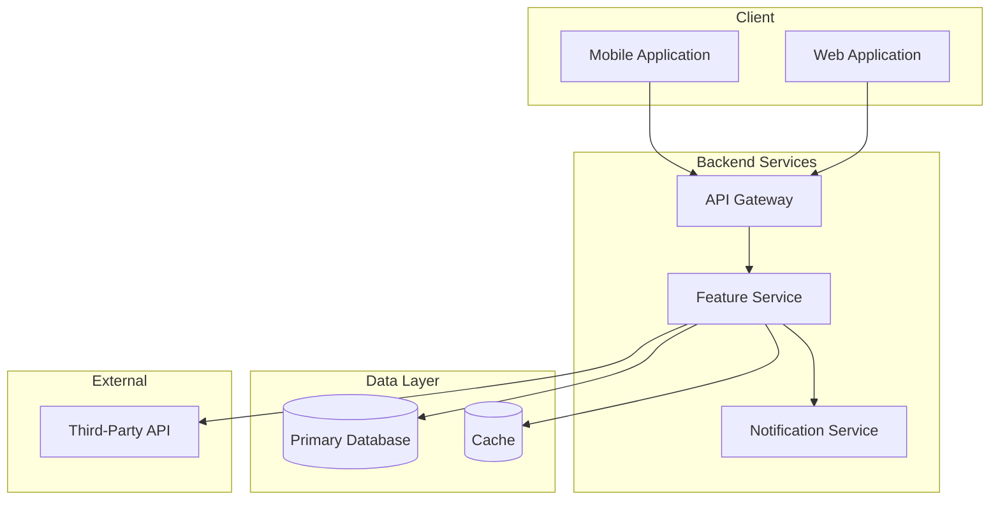

# [Product/Feature Name] -- Product Requirements Document

## 1. Document Information

| Field       | Value                          |
|-------------|--------------------------------|
| PRD ID      | PRD-[MODULE]-[NNN]             |
| Version     | 0.1                            |
| Author      | [Author name]                  |
| Reviewers   | [Reviewer 1, Reviewer 2]       |
| Date        | [YYYY-MM-DD]                   |
| Status      | Draft / In Review / Approved   |

## 2. Revision History

| Version | Date       | Author          | Changes                        |
|---------|------------|-----------------|--------------------------------|
| 0.1     | YYYY-MM-DD | [Author name]   | Initial draft                  |
| [next]  | YYYY-MM-DD | [Author name]   | [Describe changes made]        |

## 3. Executive Summary

[Provide a concise two-to-four sentence summary of this product initiative. State the core problem being solved, the proposed solution at a high level, and the expected business or user impact. This section should be understandable by any stakeholder in under thirty seconds.]

## 4. Product Overview & Background

[Describe the broader product context. What is the product or system this feature belongs to? What is its current state? Include relevant history, prior initiatives, and any existing documentation that informs this PRD. A new team member should be able to read this section and understand why this initiative exists.]

## 5. Market Research & Analysis

### 5.1 Market Overview

[Describe the target market. What is the market size? What stage is the market in (emerging, growing, mature, declining)? What are the key trends shaping this space?]

### 5.2 Market Sizing

| Metric | Value | Source | Date |
|--------|-------|--------|------|
| TAM (Total Addressable Market) | [e.g., $5B globally] | [Research source] | [YYYY-MM-DD] |
| SAM (Serviceable Addressable Market) | [e.g., $800M in target region] | [Research source] | [YYYY-MM-DD] |
| SOM (Serviceable Obtainable Market) | [e.g., $50M in year 1] | [Internal estimate] | [YYYY-MM-DD] |

### 5.3 Competitive Landscape

| Competitor | Product/Feature | Strengths | Weaknesses | Market Share | Pricing Model |
|-----------|----------------|-----------|------------|-------------|---------------|
| [Competitor 1] | [Their solution] | [What they do well] | [Where they fall short] | [If known] | [Free/Freemium/Paid] |
| [Competitor 2] | [Their solution] | [What they do well] | [Where they fall short] | [If known] | [Free/Freemium/Paid] |
| [Competitor 3] | [Their solution] | [What they do well] | [Where they fall short] | [If known] | [Free/Freemium/Paid] |

### 5.4 Competitive Differentiation

[Explain how the proposed product/feature differentiates from existing competitors. What is the unique angle, technology advantage, or market gap being exploited? Why can't competitors easily replicate this?]

### 5.5 Industry Trends & Signals

- [Trend 1: Describe a relevant market or technology trend that supports this initiative]
- [Trend 2: Describe another supporting trend or regulatory shift]
- [Trend 3: Describe user behavior changes or emerging patterns]

## 6. Value Proposition & Validation

### 6.1 Core Value Proposition

[State the value proposition in one clear sentence. Use the format: "For [target users] who [have this problem], [product name] provides [key benefit] unlike [alternatives] because [unique differentiator]."]

### 6.2 Evidence of Real Demand (Anti-Pseudo-Requirement Validation)

This section exists to ensure the product addresses a genuine need, not an imagined or unvalidated one. Provide concrete evidence from at least three of the following sources:

| Evidence Type | Detail | Source | Date |
|--------------|--------|--------|------|
| User Research / Interviews | [Summary of user interview findings, number of interviews conducted, key quotes] | [e.g., 15 user interviews in Q1] | [YYYY-MM-DD] |
| Survey Data | [Survey results showing demand, sample size, key statistics] | [e.g., 500-user survey via Typeform] | [YYYY-MM-DD] |
| Support Tickets / Feedback | [Volume and pattern of related support requests or feature requests] | [e.g., 120 tickets in past 90 days] | [YYYY-MM-DD] |
| Usage Analytics | [Data showing user behavior that signals the need, e.g., drop-off rates, workaround usage] | [e.g., Mixpanel analytics dashboard] | [YYYY-MM-DD] |
| Market Validation | [Beta test results, landing page conversion rates, waitlist signups, letter of intent] | [e.g., 2000 waitlist signups] | [YYYY-MM-DD] |
| Revenue Impact Estimate | [Projected revenue impact or cost savings with assumptions stated] | [e.g., Finance team model] | [YYYY-MM-DD] |

### 6.3 What Happens If We Don't Build This?

[Describe the cost of inaction. What do users continue to suffer? What competitive ground is lost? What revenue opportunity is forfeited? Be specific with numbers where possible.]

## 7. Feasibility Analysis

### 7.1 Technical Feasibility

| Dimension | Assessment | Notes |
|-----------|-----------|-------|
| Technology Readiness | [Ready / Needs R&D / Unproven] | [Are the required technologies mature and available?] |
| Existing Infrastructure | [Sufficient / Needs Extension / New Build] | [Can current systems support this, or is new infrastructure required?] |
| Technical Risks | [Low / Medium / High] | [Key technical unknowns or challenges] |
| Prototype/POC Status | [Not Started / In Progress / Validated] | [Has a proof of concept been built and validated?] |

### 7.2 Business Feasibility

| Dimension | Assessment | Notes |
|-----------|-----------|-------|
| Revenue Model Clarity | [Clear / Needs Validation / Unclear] | [Is there a clear path to monetization or cost savings?] |
| ROI Estimate | [Positive / Break-even / Uncertain] | [Estimated return on investment with timeframe] |
| Strategic Alignment | [Core / Adjacent / Exploratory] | [How does this align with company strategy and OKRs?] |
| Stakeholder Buy-in | [Secured / In Progress / Not Started] | [Do key stakeholders support this initiative?] |

### 7.3 Resource Feasibility

| Dimension | Assessment | Notes |
|-----------|-----------|-------|
| Team Availability | [Available / Partially Available / Needs Hiring] | [Is the required team available within the timeline?] |
| Required Skills | [In-house / Needs Training / Needs External] | [Does the team have the necessary skills?] |
| Budget | [Approved / Pending / Not Requested] | [Is budget allocated for this initiative?] |
| Timeline Realism | [Achievable / Tight / At Risk] | [Can the proposed timeline be met with available resources?] |

### 7.4 Feasibility Verdict

[Provide a clear GO / CONDITIONAL GO / NO-GO recommendation based on the analysis above. If CONDITIONAL GO, list the conditions that must be met before proceeding. Be honest — a well-reasoned NO-GO saves more resources than a poorly justified GO.]

## 8. Problem Statement

### 8.1 Current Situation

[Describe the current state of the product or workflow as it relates to this initiative. What do users do today? What tools or processes are in place?]

### 8.2 Pain Points

[List the specific pain points users experience with the current situation. Use data, user research quotes, or support ticket trends where available.]

- [Pain point 1: Describe the issue and its impact on users]
- [Pain point 2: Describe the issue and its impact on users]
- [Pain point 3: Describe the issue and its impact on users]

### 8.3 Opportunity

[Describe the opportunity that addressing these pain points unlocks. Quantify the opportunity where possible -- revenue impact, time savings, user satisfaction improvement, competitive advantage.]

## 9. Goals and Non-Goals

### 9.1 Goals

- [Goal 1: State a specific, measurable, time-bound objective. Example: "Reduce average onboarding time from 15 minutes to under 5 minutes within 90 days of launch."]
- [Goal 2: State another measurable objective]
- [Goal 3: State another measurable objective]

### 9.2 Non-Goals

- [Non-goal 1: Explicitly state what is out of scope and why. Example: "This PRD does not cover migration of legacy accounts; that will be addressed in a separate initiative."]
- [Non-goal 2: State another explicit exclusion]
- [Non-goal 3: State another explicit exclusion]

## 10. User Personas

| Name          | Role              | Demographics                  | Needs                                      | Pain Points                                |
|---------------|-------------------|-------------------------------|--------------------------------------------|--------------------------------------------|
| [Persona 1]   | [Role/Title]      | [Age range, tech proficiency, usage frequency] | [What this persona needs from the product] | [What frustrates this persona today]       |
| [Persona 2]   | [Role/Title]      | [Age range, tech proficiency, usage frequency] | [What this persona needs from the product] | [What frustrates this persona today]       |
| [Persona 3]   | [Role/Title]      | [Age range, tech proficiency, usage frequency] | [What this persona needs from the product] | [What frustrates this persona today]       |

## 11. User Stories

### US-001: [Short title]

**As a** [user type from the personas above],
**I want** [action or capability],
**so that** [benefit or outcome].

**Acceptance Criteria:**

- [ ] [Testable condition 1 that must be true for this story to be considered complete]
- [ ] [Testable condition 2]
- [ ] [Testable condition 3]

### US-002: [Short title]

**As a** [user type],
**I want** [action or capability],
**so that** [benefit or outcome].

**Acceptance Criteria:**

- [ ] [Testable condition 1]
- [ ] [Testable condition 2]

### US-003: [Short title]

**As a** [user type],
**I want** [action or capability],
**so that** [benefit or outcome].

**Acceptance Criteria:**

- [ ] [Testable condition 1]
- [ ] [Testable condition 2]

[Add additional user stories as needed. Every persona should be represented by at least one user story.]

## 12. Functional Requirements Overview

| ID            | Feature                  | Description                                                   | Priority | Status      |
|---------------|--------------------------|---------------------------------------------------------------|----------|-------------|
| PRD-[MOD]-001 | [Feature name]           | [Describe what this feature does and why it is needed]        | P0       | Proposed    |
| PRD-[MOD]-002 | [Feature name]           | [Describe what this feature does and why it is needed]        | P0       | Proposed    |
| PRD-[MOD]-003 | [Feature name]           | [Describe what this feature does and why it is needed]        | P1       | Proposed    |
| PRD-[MOD]-004 | [Feature name]           | [Describe what this feature does and why it is needed]        | P1       | Proposed    |
| PRD-[MOD]-005 | [Feature name]           | [Describe what this feature does and why it is needed]        | P2       | Proposed    |

**Priority Legend:**

- **P0 -- Must Have:** Required for launch. Cannot ship without this.
- **P1 -- Should Have:** Significantly improves the product but not strictly required for minimum viable launch.
- **P2 -- Nice to Have:** Enhancement that can be deferred to a subsequent release.

## 13. User Journey

[Describe the primary user journey through the feature. The Mermaid flowchart below should illustrate the happy path and key decision points.]



[Replace the diagram above with the actual user journey for your feature. Include branching paths for error handling, edge cases, and alternative flows.]

## 14. Feature Architecture

[Provide a high-level view of how the feature's components interact. This is not a detailed system design; it is a conceptual map showing services, APIs, data stores, and external systems involved.]



[Replace the diagram above with the actual architecture for your feature. Label each component clearly and show the direction of data flow.]

## 15. Success Metrics

| Metric                        | Type    | Target Value       | Measurement Method                     | Current Baseline   |
|-------------------------------|---------|--------------------|----------------------------------------|--------------------|
| [Metric 1, e.g., Task completion rate] | KPI     | [e.g., >= 95%]     | [e.g., Analytics event tracking]       | [e.g., 78%]        |
| [Metric 2, e.g., Time to complete]     | KPI     | [e.g., < 3 min]    | [e.g., Timer from start to finish]     | [e.g., 12 min]     |
| [Metric 3, e.g., User satisfaction]    | OKR     | [e.g., NPS >= 50]  | [e.g., In-app survey post-task]        | [e.g., NPS 32]     |
| [Metric 4, e.g., Error rate]           | KPI     | [e.g., < 1%]       | [e.g., Error log monitoring]           | [e.g., 5.2%]       |
| [Metric 5, e.g., Adoption rate]        | OKR     | [e.g., 60% in 90d] | [e.g., Unique users / total users]     | [e.g., N/A (new)]  |

[Ensure every metric ties back to a goal defined in Section 6. If a metric does not support a stated goal, reconsider whether it belongs here.]

## 16. Timeline & Milestones

[Outline the major phases and milestones for delivering this feature. The Gantt chart below provides a visual timeline.]

```mermaid
gantt
    title Feature Development Timeline
    dateFormat  YYYY-MM-DD
    axcludeWeekends

    section Design
    User research & analysis    :des1, 2025-01-06, 10d
    UX wireframes               :des2, after des1, 7d
    Design review               :milestone, after des2, 0d

    section Development
    Backend implementation      :dev1, after des2, 15d
    Frontend implementation     :dev2, after des2, 15d
    Integration                 :dev3, after dev1, 5d

    section Testing
    QA testing                  :test1, after dev3, 10d
    UAT                         :test2, after test1, 5d
    Bug fixes                   :test3, after test2, 5d

    section Launch
    Staged rollout              :launch1, after test3, 7d
    Full release                :milestone, after launch1, 0d
```

[Replace the dates and durations above with actuals for your project. Mark critical-path items and external dependencies.]

## 17. Risk Assessment Matrix

| Risk ID       | Description                                      | Likelihood (H/M/L) | Impact (H/M/L) | Mitigation Strategy                                | Owner           |
|---------------|--------------------------------------------------|---------------------|-----------------|-----------------------------------------------------|-----------------|
| RISK-001      | [Describe the risk scenario]                     | [H/M/L]            | [H/M/L]        | [Describe how this risk will be mitigated or avoided] | [Team/Person]   |
| RISK-002      | [Describe the risk scenario]                     | [H/M/L]            | [H/M/L]        | [Describe mitigation strategy]                       | [Team/Person]   |
| RISK-003      | [Describe the risk scenario]                     | [H/M/L]            | [H/M/L]        | [Describe mitigation strategy]                       | [Team/Person]   |
| RISK-004      | [Describe the risk scenario]                     | [H/M/L]            | [H/M/L]        | [Describe mitigation strategy]                       | [Team/Person]   |

[Assess each risk honestly. High-likelihood, high-impact risks should have robust mitigation plans and clearly assigned owners.]

## 18. Dependencies

[List all internal and external dependencies that could affect the delivery of this feature.]

### Internal Dependencies

- [Dependency 1: Describe the dependency, the team that owns it, and the expected resolution date]
- [Dependency 2: Describe the dependency and its timeline]

### External Dependencies

- [Dependency 1: Describe the third-party service, API, or vendor dependency and any contractual or technical constraints]
- [Dependency 2: Describe the external dependency]

## 19. Open Questions

[List all unresolved questions that need answers before the PRD can be finalized or implementation can begin.]

| #  | Question                                                      | Owner           | Due Date   | Resolution |
|----|---------------------------------------------------------------|-----------------|------------|------------|
| 1  | [Describe the open question]                                  | [Person/Team]   | YYYY-MM-DD | Pending    |
| 2  | [Describe the open question]                                  | [Person/Team]   | YYYY-MM-DD | Pending    |
| 3  | [Describe the open question]                                  | [Person/Team]   | YYYY-MM-DD | Pending    |

## 20. Appendix

[Include any supplementary material that supports the PRD but does not belong in the main sections.]

- **Research Data:** [Link to or summarize user research findings]
- **Competitive Analysis:** [Link to or summarize competitive landscape analysis]
- **Wireframes/Mockups:** [Link to design files in Figma, Sketch, or equivalent]
- **Technical Spikes:** [Link to or summarize any technical investigation results]
- **Glossary:** [Define domain-specific terms used throughout this document]
