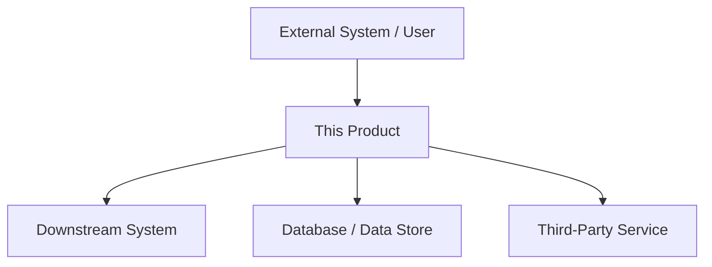
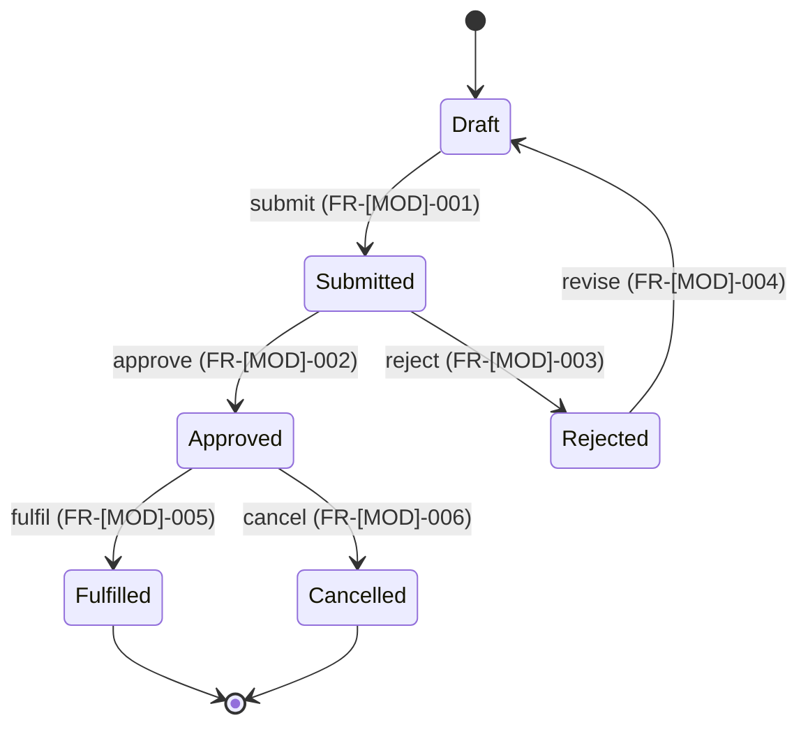
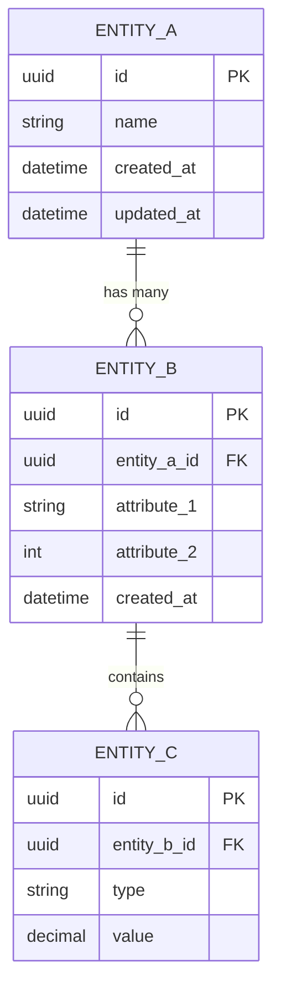

# Software Requirements Specification: [Feature Name]

## 1. Document Information

| Field            | Value                          |
|------------------|--------------------------------|
| **Document ID**  | SRS-[FEATURE]-001              |
| **Version**      | 0.1                            |
| **Author**       | [Author name]                  |
| **Reviewers**    | [Reviewer names]               |
| **Date**         | [YYYY-MM-DD]                   |
| **Status**       | Draft / In Review / Approved   |
| **Related PRD**  | [Link to docs/{feature}/prd.md]  |

## 2. Revision History

| Version | Date       | Author        | Description of Changes      |
|---------|------------|---------------|-----------------------------|
| 0.1     | YYYY-MM-DD | [Author name] | Initial draft               |

## 3. Introduction

### 3.1 Purpose

[Describe the purpose of this SRS document. Identify the software product to be produced by name. Explain what the software product will do and, if necessary, what it will not do. Describe the intended audience for this document -- developers, testers, project managers, and stakeholders who need to understand the detailed requirements.]

### 3.2 Scope Boundaries

[Describe the scope of the software product covered by this SRS. Include the product name, what the product will do, and the benefits, objectives, and goals of the product. Be consistent with the scope defined in the upstream PRD if one exists.]

**In scope.** Everything the implementer is obligated to deliver under this specification:

| # | In scope | Governed by |
|---|----------|-------------|
| 1 | [Deliverable capability stated in one sentence] | FR-[MOD]-001 … FR-[MOD]-00N |
| 2 | [Deliverable capability] | FR-[MOD]-0NN |

**Out of scope.** Everything a reader might reasonably assume is included but is not. Each row is an explicit exclusion, not an omission:

| # | Out of scope | Why excluded | Who owns it instead |
|---|--------------|--------------|---------------------|
| 1 | [e.g., "Migration of pre-2024 historical records"] | [e.g., "handled by the separate data-migration project"] | [e.g., "Platform team, tracked in DATA-441"] |
| 2 | [e.g., "Mobile native client"] | [e.g., "web-responsive only for this release"] | [e.g., "deferred, no owner yet"] |
| 3 | [e.g., "SSO with customer-hosted identity providers"] | [e.g., "only Google and GitHub OAuth in this phase"] | [e.g., "backlog item AUTH-88"] |

> **Why this section is mandatory.** Ambiguity about what is *not* included is the single most common source of delivery disputes. An empty or hand-waved out-of-scope table means every reader fills the gap with their own assumption, and those assumptions only surface at acceptance time. If genuinely nothing is excluded, state that explicitly with a one-line justification rather than leaving the table empty.

**Interpretation precedence.** When this document and any other artefact disagree, the order of precedence is: (1) this SRS, (2) the upstream PRD, (3) the technical design, (4) verbal or chat agreements — which are not binding until reflected here via §10.3 change control.

### 3.3 Definitions, Acronyms, and Abbreviations

| Term          | Definition                                                      |
|---------------|-----------------------------------------------------------------|
| SRS           | Software Requirements Specification                             |
| PRD           | Product Requirements Document                                   |
| FR            | Functional Requirement                                          |
| NFR           | Non-Functional Requirement                                      |
| RTM           | Requirements Traceability Matrix                                |
| CRUD          | Create, Read, Update, Delete                                    |
| [Term]        | [Describe the meaning of this term in the project context]      |

### 3.4 References

| Document                              | Version | Date       |
|---------------------------------------|---------|------------|
| [PRD document name and link]          | [x.x]   | YYYY-MM-DD |
| [API specification or design doc]     | [x.x]   | YYYY-MM-DD |
| [Regulatory or compliance standard]   | [x.x]   | YYYY-MM-DD |
| [Other referenced document]           | [x.x]   | YYYY-MM-DD |

### 3.5 Overview

[Describe the organization of the remainder of this SRS. Explain what each subsequent section contains so that readers can navigate the document efficiently.]

## 4. Overall Description

### 4.1 Product Perspective

[Describe how the software product fits into the larger system or product ecosystem. If this is a component of a larger system, describe the interfaces between this product and the larger system. Include a high-level context diagram if helpful.]

```mermaid
graph TD
    A[External System / User] --> B[This Product]
    B --> C[Downstream System]
    B --> D[Database / Data Store]
    B --> E[Third-Party Service]
```

### 4.2 Product Functions

[Provide a high-level summary of the major functions the software will perform. This should be a summary -- detailed functional requirements follow in Section 5. Organize by feature area or module.]

- **[Module 1 Name]**: [Brief description of what this module does]
- **[Module 2 Name]**: [Brief description of what this module does]
- **[Module 3 Name]**: [Brief description of what this module does]

### 4.3 User Characteristics

> If the upstream PRD (§10.1) identifies AI Agent as an applicable consumer, include agent user classes in this table alongside human user classes. If no upstream PRD exists, explicitly consider whether AI agents are realistic consumers of this system.

| User Class | Consumer Type | Description | Technical Proficiency | Interaction Pattern |
|-----------|--------------|-------------|----------------------|-------------------|
| [e.g., End User] | Human | [Describe who they are and what they do] | Low / Medium / High | [e.g., Web UI, mobile app] |
| [e.g., Administrator] | Human | [Describe who they are and what they do] | Medium / High | [e.g., Admin dashboard, CLI] |
| [e.g., API Consumer] | Human | [Describe who they are and what they do] | High | [e.g., REST API, SDK] |
| [e.g., CI Pipeline Agent] | AI Agent | [Describe the agent's purpose, autonomy level, and operational context — e.g., "Autonomous agent that polls build status and triggers deployments; operates on 30s intervals with no human oversight per cycle"] | N/A | [e.g., REST API with service token, webhook listener, MCP tool call] |
| [e.g., Coding Assistant] | AI Agent | [Describe the agent — e.g., "Human-in-the-loop agent that retrieves code context and suggests changes; user approves each action"] | N/A | [e.g., REST API, streaming response required for real-time feedback] |

### 4.4 Constraints

[List any constraints that will affect the design and implementation of the software. These may include regulatory policies, hardware limitations, interfaces to other applications, parallel operation, audit functions, control functions, higher-order language requirements, signal handshake protocols, reliability requirements, criticality of the application, or safety and security considerations.]

- [Describe constraint 1]
- [Describe constraint 2]
- [Describe constraint 3]

### 4.5 Assumptions and Dependencies

[List any assumptions that, if changed, would affect the requirements in this SRS. Also list dependencies on external factors such as third-party services, hardware availability, or other project deliverables.]

**Assumptions:**
- [Describe assumption 1]
- [Describe assumption 2]

**Dependencies:**
- [Describe dependency 1]
- [Describe dependency 2]

## 5. Functional Requirements

### 5.1 [Module Name 1]

#### FR-[MOD1]-001: [Requirement Title]

| Field                    | Value                                                    |
|--------------------------|----------------------------------------------------------|
| **ID**                   | FR-[MOD1]-001                                            |
| **Title**                | [Concise requirement title]                              |
| **Priority**             | P0 / P1 / P2                                            |
| **Priority Rationale**   | [Why this priority — e.g., "P0: launch cannot proceed without this capability; it is the core action the product is built around" or "P2: improves UX but existing workaround is acceptable for v1"] |
| **Source**               | [PRD-XXX-NNN or stakeholder reference]                   |

**Description:**
[The system shall ... Describe what the system must do in clear, unambiguous language. Use "shall" for mandatory behavior.]

**Actors:**
- [Primary actor, e.g., Authenticated User — or AI Agent name from §4.3 if this requirement serves agent consumers]
- [Secondary actor, e.g., Notification Service]

> When the primary actor is an AI Agent, describe the flow in terms of API calls and programmatic actions (not UI interactions). Include machine-parseable error responses, idempotency expectations, and structured output requirements in the acceptance criteria.

**Preconditions:**
- [Condition that must be true before this requirement can be exercised]
- [Another precondition]

**Input Field Rules:**

| Field | Type | Required | Constraints | Default | Boundary / rejection behavior |
|-------|------|----------|-------------|---------|-------------------------------|
| [e.g., `email`] | string | Yes | [e.g., RFC 5322 format, max 254 chars, lowercased before storage] | — | [e.g., "> 254 chars → reject with `VAL_TOO_LONG`; malformed → `VAL_FORMAT`"] |
| [e.g., `quantity`] | integer | Yes | [e.g., 1 ≤ n ≤ 999] | — | [e.g., "0 or negative → `VAL_RANGE`; 1000+ → `VAL_RANGE`; non-integer → `VAL_TYPE`"] |
| [e.g., `nickname`] | string | No | [e.g., 2–32 chars, Unicode letters/digits/underscore] | `null` | [e.g., "empty string is treated as absent, not as a validation error"] |

> **Mandatory for any requirement that accepts input.** Every field an actor can supply gets a row. State the *exact* rule, not a category: "max 254 characters" not "reasonable length"; "1 ≤ n ≤ 999" not "a positive number". The rejection behavior column must name the specific error from the §5.6 Error Catalogue so that validation is verifiable rather than negotiable. Omit this block only for requirements that take no input (e.g., a scheduled job with no parameters), and say so explicitly rather than deleting the heading silently.

**Main Flow:**
1. [The actor performs action X — for agents: "The agent sends POST /api/v1/resource with JSON body {fields}"]
2. [The system validates input Y]
3. [The system processes the request and performs Z]
4. [The system returns result W to the actor — for agents: "The system returns 201 with JSON body containing {resource_id, created_at}"]

**Alternative Flows:**
- **AF-1: [Alternative scenario name]**
  1. [At step N of the main flow, if condition C occurs...]
  2. [The system shall perform alternative action A]
  3. [The flow returns to step M / The flow ends]

- **AF-2: [Error scenario name]**
  1. [At step N of the main flow, if validation fails...]
  2. [The system shall return error response E — for agents: "return 422 with JSON {error_code, message, field, constraint} enabling programmatic retry decisions"]
  3. [The flow returns to step M]

> **Error-flow rule:** Every operation error must report the **real, specific cause** of the failure. Each error flow specifies a distinct, diagnosable outcome — exactly which condition failed and the response the actor receives, with a message that names the actual cause (which field, which rule, which entity, which state) — never a vague "the operation failed" or a generic server error. Enumerate each *anticipated* failure as its own distinguishable flow. Failure types to cover wherever they apply: invalid input, a uniqueness violation (a record that already exists), a missing referenced entity, an invalid state transition, insufficient permission, resource-not-found, and any business-rule violation specific to this requirement. The goal is that the actor always learns precisely what went wrong and why, so the downstream tech-design can map each cause to a specific error code (never a generic 500).

**Postconditions:**
- [State of the system after successful completion of the main flow]
- [Observable side effects, e.g., database record created, notification sent]

**Acceptance Criteria:**
- [ ] [Given ... When ... Then ... -- specific testable criterion]
- [ ] [Given ... When ... Then ... -- another testable criterion]
- [ ] [Boundary condition or edge case criterion]

---

#### FR-[MOD1]-002: [Requirement Title]

| Field                    | Value                                                    |
|--------------------------|----------------------------------------------------------|
| **ID**                   | FR-[MOD1]-002                                            |
| **Title**                | [Concise requirement title]                              |
| **Priority**             | P0 / P1 / P2                                            |
| **Priority Rationale**   | [Why this priority]                                      |
| **Source**               | [PRD-XXX-NNN or stakeholder reference]                   |

**Description:**
[The system shall ... ]

**Actors:**
- [Actor]

**Preconditions:**
- [Precondition]

**Input Field Rules:**

| Field | Type | Required | Constraints | Default | Boundary / rejection behavior |
|-------|------|----------|-------------|---------|-------------------------------|
| [field] | [type] | [Yes/No] | [exact rule — a value or range, never a category] | [value or —] | [condition → `ERROR_CODE` from §5.6] |

[If this requirement accepts no input, replace the table with: **N/A — this requirement takes no actor-supplied input.**]

**Main Flow:**
1. [Step 1]
2. [Step 2]
3. [Step 3]

**Alternative Flows:**
- **AF-1: [Scenario name]**
  1. [Alternative step]

**Postconditions:**
- [Postcondition]

**Acceptance Criteria:**
- [ ] [Given ... When ... Then ... — testable criterion]
- [ ] [Given ... When ... Then ... — testable criterion]

---

### 5.2 [Module Name 2]

#### FR-[MOD2]-001: [Requirement Title]

[Repeat the same structure as above for each functional requirement in this module.]

---

### 5.3 CRUD Matrix

| Entity             | Create          | Read            | Update          | Delete          |
|--------------------|-----------------|-----------------|-----------------|-----------------|
| [Entity 1]        | FR-[MOD]-[NNN]  | FR-[MOD]-[NNN]  | FR-[MOD]-[NNN]  | FR-[MOD]-[NNN]  |
| [Entity 2]        | FR-[MOD]-[NNN]  | FR-[MOD]-[NNN]  | FR-[MOD]-[NNN]  | FR-[MOD]-[NNN]  |
| [Entity 3]        | FR-[MOD]-[NNN]  | FR-[MOD]-[NNN]  | FR-[MOD]-[NNN]  | FR-[MOD]-[NNN]  |
| [Entity 4]        | --               | FR-[MOD]-[NNN]  | FR-[MOD]-[NNN]  | --               |

> Note: A dash (--) indicates that the operation is not applicable or is intentionally not supported for that entity. Ensure every cell is accounted for -- missing operations should be a deliberate decision, not an oversight.

### 5.4 State Machines

[For every entity that has a lifecycle — order, subscription, ticket, document, job — specify the complete state machine. Omit this section only if no entity in the system has more than one state, and say so explicitly.]

#### 5.4.1 [Entity name] state machine

```mermaid
stateDiagram-v2
    [*] --> Draft
    Draft --> Submitted: submit (FR-[MOD]-001)
    Submitted --> Approved: approve (FR-[MOD]-002)
    Submitted --> Rejected: reject (FR-[MOD]-003)
    Rejected --> Draft: revise (FR-[MOD]-004)
    Approved --> Fulfilled: fulfil (FR-[MOD]-005)
    Approved --> Cancelled: cancel (FR-[MOD]-006)
    Fulfilled --> [*]
    Cancelled --> [*]
```

**Legal transitions:**

| From | To | Trigger | Actor / permission | Guard condition | Governed by |
|------|----|---------|--------------------|-----------------|-------------|
| Draft | Submitted | [submit] | [Owner] | [e.g., "all required fields present"] | FR-[MOD]-001 |
| Submitted | Approved | [approve] | [Reviewer] | [e.g., "reviewer ≠ submitter"] | FR-[MOD]-002 |

**Illegal transition handling:**

| Attempted transition | System behavior | Error code | Actor-visible message |
|----------------------|-----------------|------------|-----------------------|
| [e.g., Draft → Approved] | [e.g., "reject, no state change, no side effects"] | [e.g., `STATE_INVALID_TRANSITION`] | [e.g., "A draft must be submitted before it can be approved."] |
| [e.g., Fulfilled → Cancelled] | [e.g., "reject; cancellation after fulfilment requires the refund flow"] | [e.g., `STATE_TERMINAL`] | [e.g., "This order is already fulfilled. Use Request refund instead."] |

> **Mandatory rule.** Specifying only the legal transitions is half a state machine. Every transition *not* listed in the legal table must have a defined rejection behavior — silence here means the implementer picks a behavior and acceptance testing discovers it. State explicitly whether an illegal transition is idempotent-ignored or hard-rejected, and whether any side effects (notifications, audit entries) fire on rejection.

### 5.5 Permission Matrix

[Specify which role may perform which operation, on which data scope. One row per role, one column per operation group.]

| Role | Create | Read | Update | Delete | Approve | Data scope |
|------|--------|------|--------|--------|---------|------------|
| [e.g., Owner] | ✅ | ✅ | ✅ | ✅ | ❌ | [e.g., "own records only"] |
| [e.g., Reviewer] | ❌ | ✅ | ❌ | ❌ | ✅ | [e.g., "all records in own team"] |
| [e.g., Admin] | ✅ | ✅ | ✅ | ✅ | ✅ | [e.g., "all records, all tenants"] |
| [e.g., Unauthenticated] | ❌ | ❌ | ❌ | ❌ | ❌ | — |

**Data scope definitions:**

| Scope | Meaning |
|-------|---------|
| [e.g., own records] | [e.g., "records where `owner_id` equals the authenticated principal"] |
| [e.g., own team] | [e.g., "records whose `team_id` is in the principal's team membership set"] |

> **Denial behavior.** State the response for an unauthorized attempt, and be deliberate about information disclosure: does the system return `403 Forbidden` (revealing the record exists) or `404 Not Found` (concealing it)? This is a security decision, not an implementation detail — specify it here rather than leaving it to the implementer.

### 5.6 Error Catalogue

[Every error an actor can observe, with its code, trigger condition, user-facing message, and recovery path. The tech design maps these to transport-level status codes; this table defines the contract.]

| Error code | Trigger condition | Actor-visible message | Recovery / degradation | Raised by |
|------------|-------------------|-----------------------|------------------------|-----------|
| `VAL_FORMAT` | [Input fails format validation] | [e.g., "Enter a valid email address."] | [e.g., "actor corrects input and retries"] | FR-[MOD]-001 |
| `VAL_RANGE` | [Numeric input outside the declared bounds] | [e.g., "Quantity must be between 1 and 999."] | [e.g., "actor corrects input and retries"] | FR-[MOD]-001 |
| `DUP_CONFLICT` | [Uniqueness constraint violated] | [e.g., "An account with this email already exists."] | [e.g., "offer sign-in or password reset"] | FR-[MOD]-002 |
| `STATE_INVALID_TRANSITION` | [Transition not permitted from current state] | [Name the current state and the required precondition] | [e.g., "actor performs the prerequisite action first"] | §5.4 |
| `PERM_DENIED` | [Actor lacks the required permission] | [e.g., "You do not have permission to approve this request."] | [e.g., "actor requests access from an admin"] | §5.5 |
| `DEP_UNAVAILABLE` | [A required downstream dependency is unreachable] | [e.g., "Payment processing is temporarily unavailable. Your cart has been saved."] | [**Degradation:** state what still works, whether the operation is queued for retry, and the retry window] | FR-[MOD]-00N |

> **No generic failures.** `INTERNAL_ERROR` is not an acceptable entry for any *anticipated* condition. Every failure mode enumerated in an alternative flow must appear here as a distinct, diagnosable code. A catalogue that collapses distinct causes into one code makes the failure untestable and pushes diagnosis onto the actor.
>
> **Degradation is a requirement, not a nicety.** For every dependency this feature relies on, specify what happens when it is unavailable: fail closed, fail open, serve stale data (and how stale is acceptable), or queue for retry (and for how long). Leaving this unspecified means the behavior under partial outage is whatever the implementation happens to do.

## 6. Non-Functional Requirements

> **Every NFR carries four fields that make it acceptable rather than aspirational:** a **Metric** (what is measured), a **Target** (the exact threshold), a **Threshold Rationale** (why that number and not a higher or lower one), and a **Verification** method — one of **Test**, **Demonstration**, **Inspection**, or **Analysis**, naming the environment and conditions under which the measurement is taken. An NFR with a target but no agreed verification method cannot be accepted or disputed on any objective basis; it is a wish, not a requirement. See §10.1 for how these feed acceptance.

### 6.1 Performance Requirements

#### NFR-PERF-001: [Requirement Title]

| Field                    | Value                                                   |
|--------------------------|---------------------------------------------------------|
| **ID**                   | NFR-PERF-001                                            |
| **Title**                | [e.g., API Response Time]                               |
| **Priority**             | P0 / P1 / P2                                           |
| **Metric**               | [e.g., Response time at 95th percentile]                |
| **Target**               | [e.g., < 200ms]                                         |
| **Threshold Rationale**  | [Why this specific target — e.g., "200ms is the threshold beyond which users perceive lag (Nielsen 1993); our primary competitor achieves ~180ms p95, so matching is table stakes for launch"] |
| **Measurement**          | [e.g., Application Performance Monitoring (APM) tool]   |
| **Verification**         | [Test / Demonstration / Inspection / Analysis + conditions — e.g., "Test: k6 load run at 500 RPS sustained 10 min against staging with production-equivalent data volume"] |

**Description:**
[The system shall ... Describe the performance requirement with specific, measurable targets.]

#### NFR-PERF-002: [Requirement Title]

| Field                    | Value                                                   |
|--------------------------|---------------------------------------------------------|
| **ID**                   | NFR-PERF-002                                            |
| **Title**                | [e.g., Concurrent User Capacity]                        |
| **Priority**             | P0 / P1 / P2                                           |
| **Metric**               | [e.g., Number of simultaneous users]                    |
| **Target**               | [e.g., 10,000 concurrent users]                         |
| **Threshold Rationale**  | [Why this capacity — e.g., "current peak is 6K users; 10K provides 1.7× headroom for projected 6-month growth without re-architecture"] |
| **Measurement**          | [e.g., Load testing with k6 / JMeter]                  |

**Description:**
[The system shall ... ]

### 6.2 Security Requirements

#### NFR-SEC-001: [Requirement Title]

| Field                    | Value                                                   |
|--------------------------|---------------------------------------------------------|
| **ID**                   | NFR-SEC-001                                             |
| **Title**                | [e.g., Authentication Mechanism]                        |
| **Priority**             | P0 / P1 / P2                                           |
| **Metric**               | [e.g., Compliance with OAuth 2.0 / OIDC specification] |
| **Target**               | [e.g., Full compliance]                                 |
| **Threshold Rationale**  | [Why this standard — e.g., "OAuth 2.0 + OIDC is the industry baseline required by enterprise customers; alternatives like API keys are insufficient for the user-delegated access model this feature requires"] |
| **Measurement**          | [e.g., Security audit, penetration testing]             |

**Description:**
[The system shall ... ]

#### NFR-SEC-002: [Requirement Title]

| Field                    | Value                                                   |
|--------------------------|---------------------------------------------------------|
| **ID**                   | NFR-SEC-002                                             |
| **Title**                | [e.g., Data Encryption at Rest]                         |
| **Priority**             | P0 / P1 / P2                                           |
| **Metric**               | [e.g., Encryption standard]                             |
| **Target**               | [e.g., AES-256]                                         |
| **Threshold Rationale**  | [Why AES-256 — e.g., "required by SOC 2 Type II controls; AES-128 would also be cryptographically sufficient but 256 is the documented policy standard"] |
| **Measurement**          | [e.g., Security audit]                                  |

**Description:**
[The system shall ... ]

### 6.3 Reliability Requirements

#### NFR-REL-001: [Requirement Title]

| Field                    | Value                                                   |
|--------------------------|---------------------------------------------------------|
| **ID**                   | NFR-REL-001                                             |
| **Title**                | [e.g., Mean Time Between Failures]                      |
| **Priority**             | P0 / P1 / P2                                           |
| **Metric**               | [e.g., MTBF]                                            |
| **Target**               | [e.g., > 720 hours]                                     |
| **Threshold Rationale**  | [Why this target — e.g., "720 hours = 30 days MTBF; derived from current production baseline of 850h minus one standard deviation as a conservative floor"] |
| **Measurement**          | [e.g., Production monitoring over 90-day window]        |

**Description:**
[The system shall ... ]

### 6.4 Availability Requirements

#### NFR-AVL-001: [Requirement Title]

| Field                    | Value                                                   |
|--------------------------|---------------------------------------------------------|
| **ID**                   | NFR-AVL-001                                             |
| **Title**                | [e.g., System Uptime SLA]                               |
| **Priority**             | P0 / P1 / P2                                           |
| **Metric**               | [e.g., Uptime percentage]                               |
| **Target**               | [e.g., 99.9% (8.76 hours downtime per year)]            |
| **Threshold Rationale**  | [Why this SLA tier — e.g., "99.9% matches the contractual SLA in enterprise customer agreements; 99.99% would require active-active multi-region infrastructure not in scope for v1"] |
| **Measurement**          | [e.g., Uptime monitoring service]                       |

**Description:**
[The system shall ... ]

### 6.5 Maintainability Requirements

#### NFR-MNT-001: [Requirement Title]

| Field                    | Value                                                   |
|--------------------------|---------------------------------------------------------|
| **ID**                   | NFR-MNT-001                                             |
| **Title**                | [e.g., Code Coverage Threshold]                         |
| **Priority**             | P0 / P1 / P2                                           |
| **Metric**               | [e.g., Unit test code coverage]                         |
| **Target**               | [e.g., >= 80%]                                          |
| **Threshold Rationale**  | [Why 80% — e.g., "80% is the team's existing standard across all services; going higher on new code only would create inconsistency; below 80% has historically correlated with regression-prone releases in our post-mortems"] |
| **Measurement**          | [e.g., Coverage reporting tool in CI pipeline]          |

**Description:**
[The system shall ... ]

### 6.6 Portability Requirements

#### NFR-PRT-001: [Requirement Title]

| Field                    | Value                                                   |
|--------------------------|---------------------------------------------------------|
| **ID**                   | NFR-PRT-001                                             |
| **Title**                | [e.g., Browser Compatibility]                           |
| **Priority**             | P0 / P1 / P2                                           |
| **Metric**               | [e.g., Supported browser versions]                      |
| **Target**               | [e.g., Latest 2 major versions of Chrome, Firefox, Safari, Edge] |
| **Threshold Rationale**  | [Why latest 2 versions — e.g., "analytics show 97% of users are within 2 major versions; supporting older versions would require polyfills that increase bundle size by ~40KB"] |
| **Measurement**          | [e.g., Cross-browser testing suite]                     |

**Description:**
[The system shall ... ]

### 6.7 Usability Requirements

#### NFR-USB-001: [Requirement Title]

| Field                    | Value                                                   |
|--------------------------|---------------------------------------------------------|
| **ID**                   | NFR-USB-001                                             |
| **Title**                | [e.g., Accessibility Compliance]                        |
| **Priority**             | P0 / P1 / P2                                           |
| **Metric**               | [e.g., WCAG conformance level]                          |
| **Target**               | [e.g., WCAG 2.1 Level AA]                               |
| **Threshold Rationale**  | [Why AA and not AAA — e.g., "AA is the legal baseline for ADA and EN 301 549 compliance; AAA would require restricting certain design patterns (e.g., no time limits at all) that conflict with the real-time collaboration features"] |
| **Measurement**          | [e.g., Automated accessibility audit + manual testing]  |

**Description:**
[The system shall ... ]

## 7. Data Requirements

### 7.1 Data Model

[Describe the key data entities and their relationships. Use the Mermaid ER diagram below as a starting point and expand as needed.]

```mermaid
erDiagram
    ENTITY_A ||--o{ ENTITY_B : "has many"
    ENTITY_A {
        uuid id PK
        string name
        datetime created_at
        datetime updated_at
    }
    ENTITY_B {
        uuid id PK
        uuid entity_a_id FK
        string attribute_1
        int attribute_2
        datetime created_at
    }
    ENTITY_B ||--o{ ENTITY_C : "contains"
    ENTITY_C {
        uuid id PK
        uuid entity_b_id FK
        string type
        decimal value
    }
```

### 7.2 Data Dictionary

| Field              | Type         | Constraints                        | Description                                    |
|--------------------|--------------|------------------------------------|------------------------------------------------|
| [entity.field_1]  | UUID         | PK, NOT NULL                       | [Describe what this field represents]          |
| [entity.field_2]  | VARCHAR(255) | NOT NULL, UNIQUE                   | [Describe what this field represents]          |
| [entity.field_3]  | INTEGER      | NOT NULL, DEFAULT 0, CHECK >= 0    | [Describe what this field represents]          |
| [entity.field_4]  | TIMESTAMP    | NOT NULL, DEFAULT CURRENT_TIMESTAMP| [Describe what this field represents]          |
| [entity.field_5]  | BOOLEAN      | NOT NULL, DEFAULT FALSE            | [Describe what this field represents]          |
| [entity.field_6]  | DECIMAL(10,2)| NOT NULL, CHECK >= 0               | [Describe what this field represents]          |
| [entity.field_7]  | TEXT         | NULLABLE                           | [Describe what this field represents]          |
| [entity.field_8]  | ENUM         | NOT NULL, VALUES(...)              | [Describe what this field represents]          |

## 8. External Interface Requirements

### 8.1 User Interfaces

[Describe the logical characteristics of each interface between the software product and its users. This may include screen layouts, page navigation flows, content constraints, and standards for fonts, icons, and button labels. Reference wireframes or mockups if available.]

- [Describe UI requirement 1]
- [Describe UI requirement 2]
- [Describe UI requirement 3]

### 8.2 Hardware Interfaces

[Describe the logical and physical characteristics of each interface between the software product and hardware components. This includes supported device types, minimum hardware specifications, and peripheral device interactions.]

- [Describe hardware interface requirement 1, or state "Not applicable" if none]

### 8.3 Software Interfaces

[Describe the connections between this product and other software components (operating systems, databases, libraries, third-party APIs). For each interface, specify the name, version, source, and purpose.]

| Interface              | Type         | Version    | Purpose                                    |
|------------------------|--------------|------------|--------------------------------------------|
| [e.g., PostgreSQL]    | Database     | >= 15.0    | [Describe purpose]                         |
| [e.g., Redis]         | Cache        | >= 7.0     | [Describe purpose]                         |
| [e.g., Stripe API]    | External API | v2023-xx   | [Describe purpose]                         |
| [e.g., Auth0]         | Auth Service | N/A        | [Describe purpose]                         |

### 8.4 Communication Interfaces

[Describe the requirements for any communications functions the product will use, including email, web browser protocols, network protocols, and data exchange formats.]

- **Protocol**: [e.g., HTTPS/TLS 1.3 for all client-server communication]
- **Data Format**: [e.g., JSON for REST APIs, Protocol Buffers for gRPC]
- **Message Queue**: [e.g., RabbitMQ / Kafka for asynchronous processing]
- [Describe additional communication interface requirements]

## 9. Requirements Traceability Matrix

| PRD ID          | PRD Description                     | SRS ID(s)                          | Coverage Status         |
|-----------------|-------------------------------------|------------------------------------|-------------------------|
| PRD-[MOD]-001  | [Brief PRD feature description]     | FR-[MOD]-001, FR-[MOD]-002        | Fully Covered           |
| PRD-[MOD]-002  | [Brief PRD feature description]     | FR-[MOD]-003, NFR-PERF-001        | Fully Covered           |
| PRD-[MOD]-003  | [Brief PRD feature description]     | FR-[MOD]-004                       | Partially Covered       |
| PRD-[MOD]-004  | [Brief PRD feature description]     | --                                  | Not Covered             |

> **Traceability Notes:**
> - Every PRD feature should map to at least one SRS requirement.
> - "Partially Covered" items require a note explaining what aspects are not yet specified.
> - "Not Covered" items must include a justification (e.g., deferred to a future release, out of scope).

## 10. Acceptance and Change Control

### 10.1 Definition of Acceptance

**The acceptance criteria in this document are the acceptance contract.** A requirement is accepted when every one of its Given/When/Then acceptance criteria is demonstrably satisfied, and not before. No separate acceptance document supersedes this one.

| Requirement class | Accepted when | Verified by |
|-------------------|---------------|-------------|
| Functional (FR-*) | [e.g., "every AC passes against the delivered build in the agreed environment"] | [e.g., "automated test evidence + reviewer walkthrough"] |
| Non-functional (NFR-*) | [e.g., "the measured value meets the §6 target using the stated measurement method"] | [e.g., "load-test report against the agreed baseline environment"] |
| Interface (§8) | [e.g., "contract tests pass against the published schema with no undocumented deviation"] | [e.g., "contract test suite"] |

**Verification methods.** Every acceptance criterion is verified by one of: **Test** (automated or scripted execution), **Demonstration** (operator-run walkthrough), **Inspection** (code or configuration review), or **Analysis** (modelling or calculation where direct measurement is impractical). Tag each NFR with its method in §6 — an NFR with no stated verification method is not acceptable, because there is no agreed way to settle whether it was met.

### 10.2 Acceptance Environment and Preconditions

| Item | Specification |
|------|---------------|
| Environment | [e.g., "staging, with production-equivalent data volume"] |
| Test data | [e.g., "anonymised production snapshot, ≥ 100k records"] |
| Dependencies available | [e.g., "payment sandbox, email sandbox, identity provider test tenant"] |
| Acceptance window | [e.g., "10 business days from delivery notification"] |
| Defect classification | [e.g., "Blocker = blocks acceptance; Major = fix before go-live; Minor = fix in the following release"] |

> State these explicitly. "Works on my machine" disputes are almost always disagreements about the acceptance environment that nobody wrote down.

### 10.3 Change Control Procedure

Requirements change. What must not change silently is the *contract*. Any modification to a requirement in this document follows this procedure:

1. **Raise** — the change is logged in the Change Request Log (§10.4) with a requestor and date.
2. **Impact assessment** — the assessor states the affected requirement IDs, the downstream documents affected (tech design, feature specs, plans), and the delivery impact (scope, schedule, cost).
3. **Decision** — approved, rejected, or deferred, with the decision maker named.
4. **Propagate** — on approval, this SRS is edited **in place** (never a `srs-v2.md`), the version in §1 and §2 is incremented, and downstream documents are updated. Run `/spec-forge:propagate` to find downstream references to the changed IDs.
5. **Re-baseline** — the revised requirement re-enters acceptance; previously accepted requirements are not re-opened unless the change touches them.

**Requirement ID stability.** An issued `FR-*` or `NFR-*` ID is a contract reference. It is never silently renumbered or repurposed. Split a requirement → the original ID stays with one part, new parts get new IDs. Remove a requirement → the ID is retired, never reused.

### 10.4 Change Request Log

| CR ID  | Description                        | Requestor      | Date       | Affected IDs        | Impact assessment            | Status     | Decided by     |
|--------|------------------------------------|----------------|------------|---------------------|------------------------------|------------|----------------|
| CR-001 | [Describe the change request]     | [Name]         | YYYY-MM-DD | [FR-MOD-001, ...]   | [Scope / schedule / cost]    | Pending    | [Name]         |

### 10.5 Approval

This specification is baselined when the signatories below approve it. Changes after baselining follow §10.3.

| Role | Name | Approved | Date |
|------|------|----------|------|
| Requirements owner | [Name] | ☐ | YYYY-MM-DD |
| Delivery lead | [Name] | ☐ | YYYY-MM-DD |
| [Additional approver, e.g., Security] | [Name] | ☐ | YYYY-MM-DD |

> Omit this subsection for internal work with no formal sign-off gate, but state that it was omitted deliberately rather than deleting the heading.

## 11. Appendix

### A. Supporting Diagrams

[Include any additional diagrams that help clarify the requirements -- sequence diagrams, activity diagrams, or data flow diagrams. Entity state machines belong in §5.4, not here.]

### B. Open Questions

| ID   | Question                                             | Raised By      | Date       | Status     | Resolution                  |
|------|------------------------------------------------------|----------------|------------|------------|-----------------------------|
| OQ-1 | [Describe the open question]                        | [Name]         | YYYY-MM-DD | Open       | --                           |
| OQ-2 | [Describe the open question]                        | [Name]         | YYYY-MM-DD | Resolved   | [Describe the resolution]    |

> An open question that blocks a requirement must be flagged on that requirement, not only listed here. Unresolved questions attached to a P0 requirement block baselining.

### C. Glossary

[Include any additional terms not covered in Section 3.3 that are used in this document.]
