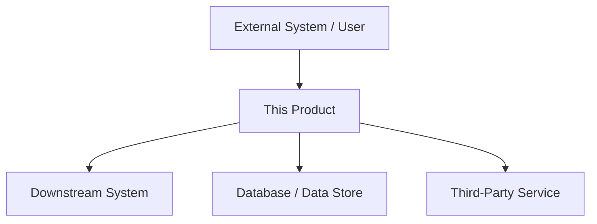
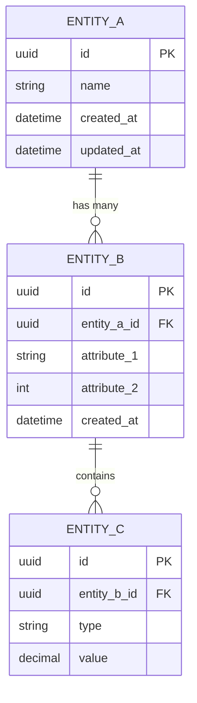

# Software Requirements Specification: [Feature Name]

## 1. Document Information

| Field            | Value                          |
|------------------|--------------------------------|
| **Document ID**  | SRS-[FEATURE]-001              |
| **Version**      | 0.1                            |
| **Author**       | [Author name]                  |
| **Reviewers**    | [Reviewer names]               |
| **Date**         | [YYYY-MM-DD]                   |
| **Status**       | Draft / In Review / Approved   |
| **Related PRD**  | [Link to docs/{feature}/prd.md]  |

## 2. Revision History

| Version | Date       | Author        | Description of Changes      |
|---------|------------|---------------|-----------------------------|
| 0.1     | YYYY-MM-DD | [Author name] | Initial draft               |

## 3. Introduction

### 3.1 Purpose

[Describe the purpose of this SRS document. Identify the software product to be produced by name. Explain what the software product will do and, if necessary, what it will not do. Describe the intended audience for this document -- developers, testers, project managers, and stakeholders who need to understand the detailed requirements.]

### 3.2 Scope

[Describe the scope of the software product covered by this SRS. Include the product name, what the product will do, and the benefits, objectives, and goals of the product. Describe the application of the software, including relevant benefits, objectives, and goals. Be consistent with the scope defined in the upstream PRD if one exists.]

### 3.3 Definitions, Acronyms, and Abbreviations

| Term          | Definition                                                      |
|---------------|-----------------------------------------------------------------|
| SRS           | Software Requirements Specification                             |
| PRD           | Product Requirements Document                                   |
| FR            | Functional Requirement                                          |
| NFR           | Non-Functional Requirement                                      |
| RTM           | Requirements Traceability Matrix                                |
| CRUD          | Create, Read, Update, Delete                                    |
| [Term]        | [Describe the meaning of this term in the project context]      |

### 3.4 References

| Document                              | Version | Date       |
|---------------------------------------|---------|------------|
| [PRD document name and link]          | [x.x]   | YYYY-MM-DD |
| [API specification or design doc]     | [x.x]   | YYYY-MM-DD |
| [Regulatory or compliance standard]   | [x.x]   | YYYY-MM-DD |
| [Other referenced document]           | [x.x]   | YYYY-MM-DD |

### 3.5 Overview

[Describe the organization of the remainder of this SRS. Explain what each subsequent section contains so that readers can navigate the document efficiently.]

## 4. Overall Description

### 4.1 Product Perspective

[Describe how the software product fits into the larger system or product ecosystem. If this is a component of a larger system, describe the interfaces between this product and the larger system. Include a high-level context diagram if helpful.]

### 4.2 Product Functions

[Provide a high-level summary of the major functions the software will perform. This should be a summary -- detailed functional requirements follow in Section 5. Organize by feature area or module.]

- **[Module 1 Name]**: [Brief description of what this module does]
- **[Module 2 Name]**: [Brief description of what this module does]
- **[Module 3 Name]**: [Brief description of what this module does]

### 4.3 User Characteristics

| User Class              | Description                                           | Technical Proficiency |
|-------------------------|-------------------------------------------------------|-----------------------|
| [e.g., End User]       | [Describe who they are and what they do]              | Low / Medium / High   |
| [e.g., Administrator]  | [Describe who they are and what they do]              | Medium / High         |
| [e.g., API Consumer]   | [Describe who they are and what they do]              | High                  |

### 4.4 Constraints

[List any constraints that will affect the design and implementation of the software. These may include regulatory policies, hardware limitations, interfaces to other applications, parallel operation, audit functions, control functions, higher-order language requirements, signal handshake protocols, reliability requirements, criticality of the application, or safety and security considerations.]

- [Describe constraint 1]
- [Describe constraint 2]
- [Describe constraint 3]

### 4.5 Assumptions and Dependencies

[List any assumptions that, if changed, would affect the requirements in this SRS. Also list dependencies on external factors such as third-party services, hardware availability, or other project deliverables.]

**Assumptions:**
- [Describe assumption 1]
- [Describe assumption 2]

**Dependencies:**
- [Describe dependency 1]
- [Describe dependency 2]

## 5. Functional Requirements

### 5.1 [Module Name 1]

#### FR-[MOD1]-001: [Requirement Title]

| Field               | Value                                                    |
|---------------------|----------------------------------------------------------|
| **ID**              | FR-[MOD1]-001                                            |
| **Title**           | [Concise requirement title]                              |
| **Priority**        | P0 / P1 / P2                                            |
| **Source**          | [PRD-XXX-NNN or stakeholder reference]                   |

**Description:**
[The system shall ... Describe what the system must do in clear, unambiguous language. Use "shall" for mandatory behavior.]

**Actors:**
- [Primary actor, e.g., Authenticated User]
- [Secondary actor, e.g., Notification Service]

**Preconditions:**
- [Condition that must be true before this requirement can be exercised]
- [Another precondition]

**Main Flow:**
1. [The actor performs action X]
2. [The system validates input Y]
3. [The system processes the request and performs Z]
4. [The system returns result W to the actor]

**Alternative Flows:**
- **AF-1: [Alternative scenario name]**
  1. [At step N of the main flow, if condition C occurs...]
  2. [The system shall perform alternative action A]
  3. [The flow returns to step M / The flow ends]

- **AF-2: [Error scenario name]**
  1. [At step N of the main flow, if validation fails...]
  2. [The system shall display error message E]
  3. [The flow returns to step M]

**Postconditions:**
- [State of the system after successful completion of the main flow]
- [Observable side effects, e.g., database record created, notification sent]

**Acceptance Criteria:**
- [ ] [Given ... When ... Then ... -- specific testable criterion]
- [ ] [Given ... When ... Then ... -- another testable criterion]
- [ ] [Boundary condition or edge case criterion]

---

#### FR-[MOD1]-002: [Requirement Title]

| Field               | Value                                                    |
|---------------------|----------------------------------------------------------|
| **ID**              | FR-[MOD1]-002                                            |
| **Title**           | [Concise requirement title]                              |
| **Priority**        | P0 / P1 / P2                                            |
| **Source**          | [PRD-XXX-NNN or stakeholder reference]                   |

**Description:**
[The system shall ... ]

**Actors:**
- [Actor]

**Preconditions:**
- [Precondition]

**Main Flow:**
1. [Step 1]
2. [Step 2]
3. [Step 3]

**Alternative Flows:**
- **AF-1: [Scenario name]**
  1. [Alternative step]

**Postconditions:**
- [Postcondition]

**Acceptance Criteria:**
- [ ] [Testable criterion]
- [ ] [Testable criterion]

---

### 5.2 [Module Name 2]

#### FR-[MOD2]-001: [Requirement Title]

[Repeat the same structure as above for each functional requirement in this module.]

---

### 5.3 CRUD Matrix

| Entity             | Create          | Read            | Update          | Delete          |
|--------------------|-----------------|-----------------|-----------------|-----------------|
| [Entity 1]        | FR-[MOD]-[NNN]  | FR-[MOD]-[NNN]  | FR-[MOD]-[NNN]  | FR-[MOD]-[NNN]  |
| [Entity 2]        | FR-[MOD]-[NNN]  | FR-[MOD]-[NNN]  | FR-[MOD]-[NNN]  | FR-[MOD]-[NNN]  |
| [Entity 3]        | FR-[MOD]-[NNN]  | FR-[MOD]-[NNN]  | FR-[MOD]-[NNN]  | FR-[MOD]-[NNN]  |
| [Entity 4]        | --               | FR-[MOD]-[NNN]  | FR-[MOD]-[NNN]  | --               |

> Note: A dash (--) indicates that the operation is not applicable or is intentionally not supported for that entity. Ensure every cell is accounted for -- missing operations should be a deliberate decision, not an oversight.

## 6. Non-Functional Requirements

### 6.1 Performance Requirements

#### NFR-PERF-001: [Requirement Title]

| Field                | Value                                                   |
|----------------------|---------------------------------------------------------|
| **ID**               | NFR-PERF-001                                            |
| **Title**            | [e.g., API Response Time]                               |
| **Priority**         | P0 / P1 / P2                                           |
| **Metric**           | [e.g., Response time at 95th percentile]                |
| **Target**           | [e.g., < 200ms]                                         |
| **Measurement**      | [e.g., Application Performance Monitoring (APM) tool]   |

**Description:**
[The system shall ... Describe the performance requirement with specific, measurable targets.]

#### NFR-PERF-002: [Requirement Title]

| Field                | Value                                                   |
|----------------------|---------------------------------------------------------|
| **ID**               | NFR-PERF-002                                            |
| **Title**            | [e.g., Concurrent User Capacity]                        |
| **Priority**         | P0 / P1 / P2                                           |
| **Metric**           | [e.g., Number of simultaneous users]                    |
| **Target**           | [e.g., 10,000 concurrent users]                         |
| **Measurement**      | [e.g., Load testing with k6 / JMeter]                  |

**Description:**
[The system shall ... ]

### 6.2 Security Requirements

#### NFR-SEC-001: [Requirement Title]

| Field                | Value                                                   |
|----------------------|---------------------------------------------------------|
| **ID**               | NFR-SEC-001                                             |
| **Title**            | [e.g., Authentication Mechanism]                        |
| **Priority**         | P0 / P1 / P2                                           |
| **Metric**           | [e.g., Compliance with OAuth 2.0 / OIDC specification] |
| **Target**           | [e.g., Full compliance]                                 |
| **Measurement**      | [e.g., Security audit, penetration testing]             |

**Description:**
[The system shall ... ]

#### NFR-SEC-002: [Requirement Title]

| Field                | Value                                                   |
|----------------------|---------------------------------------------------------|
| **ID**               | NFR-SEC-002                                             |
| **Title**            | [e.g., Data Encryption at Rest]                         |
| **Priority**         | P0 / P1 / P2                                           |
| **Metric**           | [e.g., Encryption standard]                             |
| **Target**           | [e.g., AES-256]                                         |
| **Measurement**      | [e.g., Security audit]                                  |

**Description:**
[The system shall ... ]

### 6.3 Reliability Requirements

#### NFR-REL-001: [Requirement Title]

| Field                | Value                                                   |
|----------------------|---------------------------------------------------------|
| **ID**               | NFR-REL-001                                             |
| **Title**            | [e.g., Mean Time Between Failures]                      |
| **Priority**         | P0 / P1 / P2                                           |
| **Metric**           | [e.g., MTBF]                                            |
| **Target**           | [e.g., > 720 hours]                                     |
| **Measurement**      | [e.g., Production monitoring over 90-day window]        |

**Description:**
[The system shall ... ]

### 6.4 Availability Requirements

#### NFR-AVL-001: [Requirement Title]

| Field                | Value                                                   |
|----------------------|---------------------------------------------------------|
| **ID**               | NFR-AVL-001                                             |
| **Title**            | [e.g., System Uptime SLA]                               |
| **Priority**         | P0 / P1 / P2                                           |
| **Metric**           | [e.g., Uptime percentage]                               |
| **Target**           | [e.g., 99.9% (8.76 hours downtime per year)]            |
| **Measurement**      | [e.g., Uptime monitoring service]                       |

**Description:**
[The system shall ... ]

### 6.5 Maintainability Requirements

#### NFR-MNT-001: [Requirement Title]

| Field                | Value                                                   |
|----------------------|---------------------------------------------------------|
| **ID**               | NFR-MNT-001                                             |
| **Title**            | [e.g., Code Coverage Threshold]                         |
| **Priority**         | P0 / P1 / P2                                           |
| **Metric**           | [e.g., Unit test code coverage]                         |
| **Target**           | [e.g., >= 80%]                                          |
| **Measurement**      | [e.g., Coverage reporting tool in CI pipeline]          |

**Description:**
[The system shall ... ]

### 6.6 Portability Requirements

#### NFR-PRT-001: [Requirement Title]

| Field                | Value                                                   |
|----------------------|---------------------------------------------------------|
| **ID**               | NFR-PRT-001                                             |
| **Title**            | [e.g., Browser Compatibility]                           |
| **Priority**         | P0 / P1 / P2                                           |
| **Metric**           | [e.g., Supported browser versions]                      |
| **Target**           | [e.g., Latest 2 major versions of Chrome, Firefox, Safari, Edge] |
| **Measurement**      | [e.g., Cross-browser testing suite]                     |

**Description:**
[The system shall ... ]

### 6.7 Usability Requirements

#### NFR-USB-001: [Requirement Title]

| Field                | Value                                                   |
|----------------------|---------------------------------------------------------|
| **ID**               | NFR-USB-001                                             |
| **Title**            | [e.g., Accessibility Compliance]                        |
| **Priority**         | P0 / P1 / P2                                           |
| **Metric**           | [e.g., WCAG conformance level]                          |
| **Target**           | [e.g., WCAG 2.1 Level AA]                               |
| **Measurement**      | [e.g., Automated accessibility audit + manual testing]  |

**Description:**
[The system shall ... ]

## 7. Data Requirements

### 7.1 Data Model

[Describe the key data entities and their relationships. Use the Mermaid ER diagram below as a starting point and expand as needed.]

### 7.2 Data Dictionary

| Field              | Type         | Constraints                        | Description                                    |
|--------------------|--------------|------------------------------------|------------------------------------------------|
| [entity.field_1]  | UUID         | PK, NOT NULL                       | [Describe what this field represents]          |
| [entity.field_2]  | VARCHAR(255) | NOT NULL, UNIQUE                   | [Describe what this field represents]          |
| [entity.field_3]  | INTEGER      | NOT NULL, DEFAULT 0, CHECK >= 0    | [Describe what this field represents]          |
| [entity.field_4]  | TIMESTAMP    | NOT NULL, DEFAULT CURRENT_TIMESTAMP| [Describe what this field represents]          |
| [entity.field_5]  | BOOLEAN      | NOT NULL, DEFAULT FALSE            | [Describe what this field represents]          |
| [entity.field_6]  | DECIMAL(10,2)| NOT NULL, CHECK >= 0               | [Describe what this field represents]          |
| [entity.field_7]  | TEXT         | NULLABLE                           | [Describe what this field represents]          |
| [entity.field_8]  | ENUM         | NOT NULL, VALUES(...)              | [Describe what this field represents]          |

## 8. External Interface Requirements

### 8.1 User Interfaces

[Describe the logical characteristics of each interface between the software product and its users. This may include screen layouts, page navigation flows, content constraints, and standards for fonts, icons, and button labels. Reference wireframes or mockups if available.]

- [Describe UI requirement 1]
- [Describe UI requirement 2]
- [Describe UI requirement 3]

### 8.2 Hardware Interfaces

[Describe the logical and physical characteristics of each interface between the software product and hardware components. This includes supported device types, minimum hardware specifications, and peripheral device interactions.]

- [Describe hardware interface requirement 1, or state "Not applicable" if none]

### 8.3 Software Interfaces

[Describe the connections between this product and other software components (operating systems, databases, libraries, third-party APIs). For each interface, specify the name, version, source, and purpose.]

| Interface              | Type         | Version    | Purpose                                    |
|------------------------|--------------|------------|--------------------------------------------|
| [e.g., PostgreSQL]    | Database     | >= 15.0    | [Describe purpose]                         |
| [e.g., Redis]         | Cache        | >= 7.0     | [Describe purpose]                         |
| [e.g., Stripe API]    | External API | v2023-xx   | [Describe purpose]                         |
| [e.g., Auth0]         | Auth Service | N/A        | [Describe purpose]                         |

### 8.4 Communication Interfaces

[Describe the requirements for any communications functions the product will use, including email, web browser protocols, network protocols, and data exchange formats.]

- **Protocol**: [e.g., HTTPS/TLS 1.3 for all client-server communication]
- **Data Format**: [e.g., JSON for REST APIs, Protocol Buffers for gRPC]
- **Message Queue**: [e.g., RabbitMQ / Kafka for asynchronous processing]
- [Describe additional communication interface requirements]

## 9. Requirements Traceability Matrix

| PRD ID          | PRD Description                     | SRS ID(s)                          | Coverage Status         |
|-----------------|-------------------------------------|------------------------------------|-------------------------|
| PRD-[MOD]-001  | [Brief PRD feature description]     | FR-[MOD]-001, FR-[MOD]-002        | Fully Covered           |
| PRD-[MOD]-002  | [Brief PRD feature description]     | FR-[MOD]-003, NFR-PERF-001        | Fully Covered           |
| PRD-[MOD]-003  | [Brief PRD feature description]     | FR-[MOD]-004                       | Partially Covered       |
| PRD-[MOD]-004  | [Brief PRD feature description]     | --                                  | Not Covered             |

> **Traceability Notes:**
> - Every PRD feature should map to at least one SRS requirement.
> - "Partially Covered" items require a note explaining what aspects are not yet specified.
> - "Not Covered" items must include a justification (e.g., deferred to a future release, out of scope).

## 10. Appendix

### A. Supporting Diagrams

[Include any additional diagrams that help clarify the requirements -- sequence diagrams, state machine diagrams, activity diagrams, or data flow diagrams.]

### B. Open Questions

| ID   | Question                                             | Raised By      | Date       | Status     | Resolution                  |
|------|------------------------------------------------------|----------------|------------|------------|-----------------------------|
| OQ-1 | [Describe the open question]                        | [Name]         | YYYY-MM-DD | Open       | --                           |
| OQ-2 | [Describe the open question]                        | [Name]         | YYYY-MM-DD | Resolved   | [Describe the resolution]    |

### C. Glossary

[Include any additional terms not covered in Section 3.3 that are used in this document.]

### D. Change Request Log

| CR ID  | Description                        | Requestor      | Date       | Status     | Impact Assessment            |
|--------|------------------------------------|----------------|------------|------------|------------------------------|
| CR-001 | [Describe the change request]     | [Name]         | YYYY-MM-DD | Pending    | [Describe impact on SRS]     |
