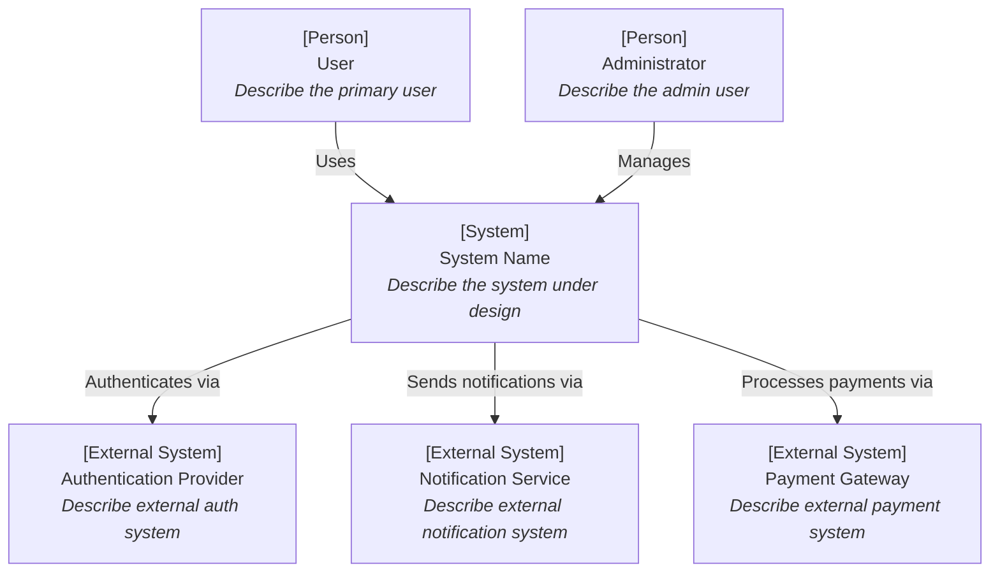
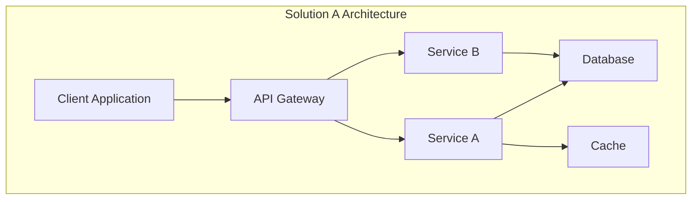
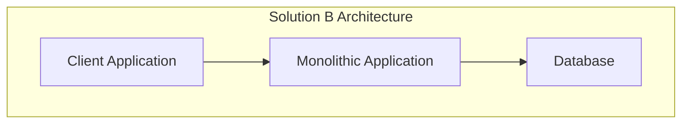
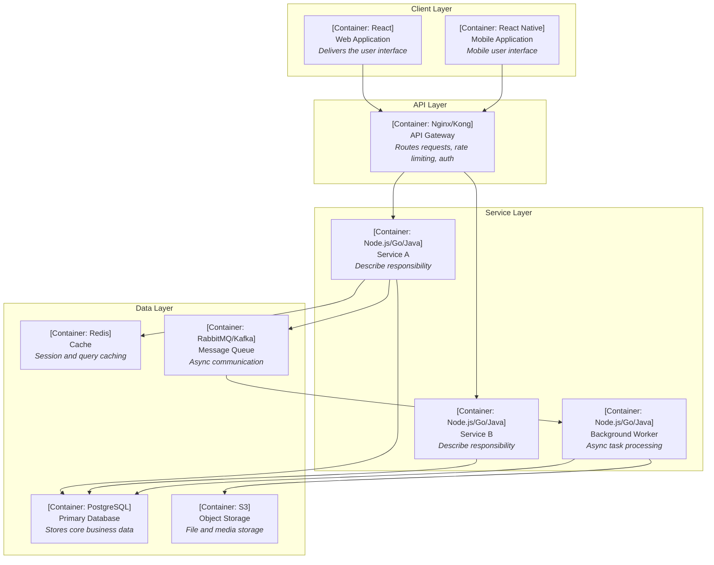
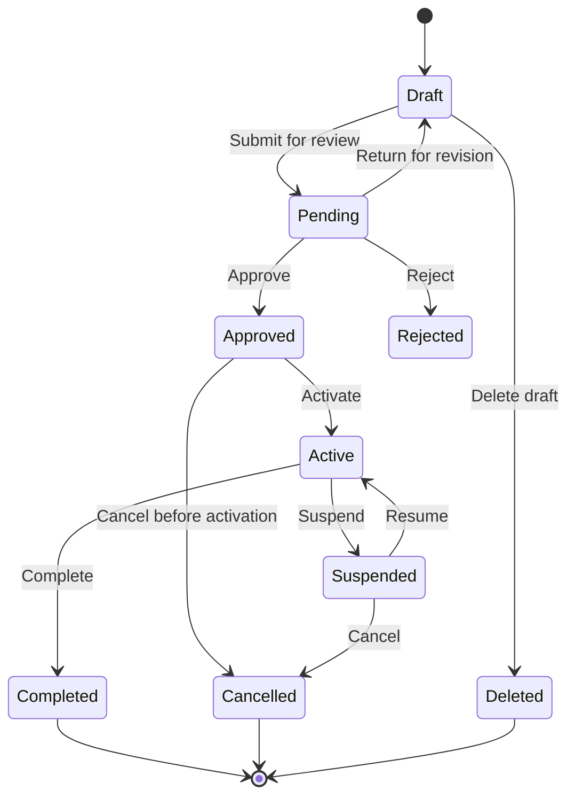
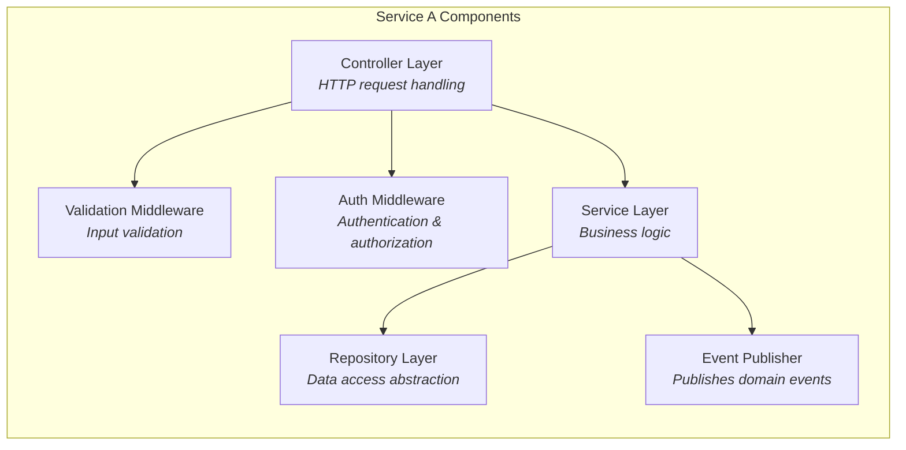
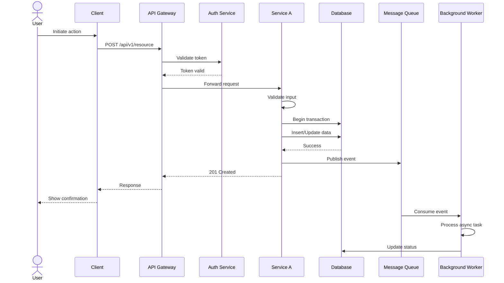
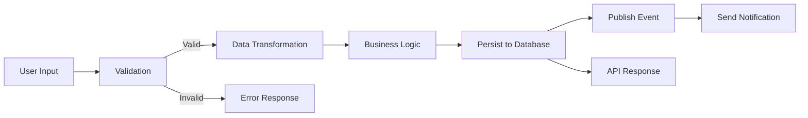
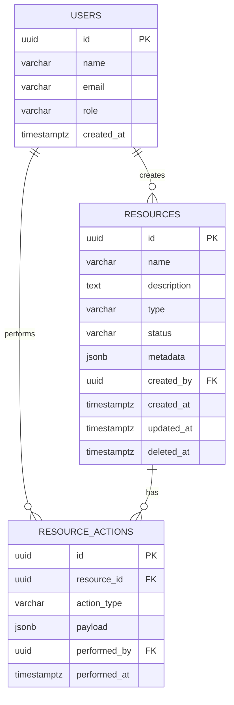

# Technical Design Document: [Feature Name]

---

## 1. Document Information

| Field | Value |
|-------|-------|
| **Document Title** | Technical Design: [Feature Name] |
| **Version** | 0.1 |
| **Author** | [Author Name] |
| **Reviewers** | [Reviewer 1], [Reviewer 2] |
| **Date** | [YYYY-MM-DD] |
| **Status** | Draft |
| **Related PRD** | [Link to PRD document or "N/A"] |
| **Related SRS** | [Link to SRS document or "N/A"] |

---

## 2. Revision History

| Version | Date | Author | Description |
|---------|------|--------|-------------|
| 0.1 | [YYYY-MM-DD] | [Author] | Initial draft |

---

## 3. Overview

### 3.1 Background

[Describe the business and technical context that motivates this design. Reference the upstream PRD and SRS documents if they exist. Explain the current state of the system and why a new design is needed.]

### 3.2 Goals

- [Goal 1: Describe a specific, measurable objective this design aims to achieve]
- [Goal 2: Describe another objective]
- [Goal 3: Describe another objective]

### 3.3 Non-Goals

- [Non-Goal 1: Describe something explicitly out of scope for this design]
- [Non-Goal 2: Describe another exclusion]

### 3.4 Scope

[Define the boundaries of this design. What systems, services, and components are affected? What is included and what is excluded?]

---

## 4. System Context

The following C4 Context Diagram shows the system under design, the users who interact with it, and the external systems it depends on or integrates with.



[Describe the context diagram. Explain the relationships between the system, its users, and external dependencies.]

---

## 5. Solution Design

### 5.1 Solution A (Recommended)

**Description:**

[Provide a detailed description of the recommended solution. Explain the key architectural decisions, technology choices, and implementation approach. Cover enough detail that a reader can understand what will be built and how.]

**Architecture:**



**Pros:**

- [Advantage 1]
- [Advantage 2]
- [Advantage 3]

**Cons:**

- [Disadvantage 1]
- [Disadvantage 2]

### 5.2 Solution B (Alternative)

**Description:**

[Provide a detailed description of the alternative solution. Explain how it differs from Solution A in approach, technology choices, or architecture.]

**Architecture:**



**Pros:**

- [Advantage 1]
- [Advantage 2]

**Cons:**

- [Disadvantage 1]
- [Disadvantage 2]
- [Disadvantage 3]

### 5.3 Comparison Matrix

| Criteria | Solution A (Recommended) | Solution B (Alternative) |
|----------|--------------------------|--------------------------|
| Implementation Complexity | [Low / Medium / High] | [Low / Medium / High] |
| Performance | [Low / Medium / High] | [Low / Medium / High] |
| Scalability | [Low / Medium / High] | [Low / Medium / High] |
| Operational Cost | [Low / Medium / High] | [Low / Medium / High] |
| Team Expertise Alignment | [Low / Medium / High] | [Low / Medium / High] |
| Time to Delivery | [Short / Medium / Long] | [Short / Medium / Long] |
| Risk Profile | [Low / Medium / High] | [Low / Medium / High] |
| Maintainability | [Low / Medium / High] | [Low / Medium / High] |

### 5.4 Decision & Rationale

[Explain the decision. State which solution is recommended and provide explicit reasoning for why it was chosen over the alternatives. Address the key differentiating factors. Explain what trade-offs are being accepted.]

---

## 6. Architecture Design

The following C4 Container Diagram shows the high-level technology building blocks of the chosen solution.



[Describe the container diagram. Explain the role of each container, the technology choices, and the communication patterns between them.]

---

## 7. Technology Stack & Conventions

### 7.1 Technology Stack Decision

| Layer | Technology | Version | Rationale |
|-------|-----------|---------|-----------|
| Programming Language | [e.g., TypeScript / Go / Java / Python / Rust] | [e.g., 5.3 / 1.22 / 21 / 3.12 / 1.75] | [Why this language was chosen for this project] |
| Runtime / Platform | [e.g., Node.js / JVM / CPython] | [e.g., 20 LTS / 21 / 3.12] | [Why this runtime] |
| Web Framework | [e.g., Express / Gin / Spring Boot / FastAPI / Actix] | [e.g., 4.x / 1.9 / 3.2 / 0.110] | [Why this framework] |
| ORM / Data Access | [e.g., Prisma / GORM / Hibernate / SQLAlchemy / Diesel] | [e.g., 5.x] | [Why this ORM or raw SQL] |
| Database | [e.g., PostgreSQL / MySQL / MongoDB / DynamoDB] | [e.g., 16] | [Why this database] |
| Cache | [e.g., Redis / Memcached / In-memory] | [e.g., 7.x] | [Why this cache] |
| Message Queue | [e.g., RabbitMQ / Kafka / SQS / NATS] | [e.g., 3.x] | [Why this queue, or N/A] |
| Search Engine | [e.g., Elasticsearch / OpenSearch / Meilisearch / N/A] | [e.g., 8.x] | [If applicable] |
| Frontend Framework | [e.g., React / Vue / Angular / Next.js / N/A] | [e.g., 18 / 3.x / 17] | [If applicable] |
| Testing Framework | [e.g., Jest / Go test / JUnit / pytest] | [e.g., 29.x] | [Why this testing framework] |
| Build Tool | [e.g., Vite / Webpack / Gradle / Make / Cargo] | [e.g., 5.x] | [Why this build tool] |
| Containerization | [e.g., Docker / Podman / N/A] | [e.g., 24.x] | [Container strategy] |

### 7.2 Naming Conventions

All code, APIs, database objects, and files must follow consistent naming conventions. Deviations from these conventions must be justified in the Open Questions section.

#### Code Naming

| Element | Convention | Example | Notes |
|---------|-----------|---------|-------|
| Files / Modules | [e.g., kebab-case / snake_case / PascalCase] | [e.g., `user-service.ts` / `user_service.py`] | [Follow language ecosystem convention] |
| Classes / Structs | [e.g., PascalCase] | [e.g., `UserService`, `OrderRepository`] | [Nouns, describing the entity or responsibility] |
| Interfaces / Traits | [e.g., PascalCase with I-prefix or no prefix] | [e.g., `IUserRepository` or `UserRepository`] | [Follow team convention] |
| Functions / Methods | [e.g., camelCase / snake_case] | [e.g., `getUserById` / `get_user_by_id`] | [Verbs, describing the action] |
| Variables | [e.g., camelCase / snake_case] | [e.g., `userId` / `user_id`] | [Descriptive, avoid abbreviations] |
| Constants | [e.g., UPPER_SNAKE_CASE] | [e.g., `MAX_RETRY_COUNT`, `DEFAULT_PAGE_SIZE`] | [All caps with underscores] |
| Enums | [e.g., PascalCase values / UPPER_SNAKE_CASE values] | [e.g., `OrderStatus.Pending` / `ORDER_STATUS_PENDING`] | [Follow language convention] |
| Test Files | [e.g., `*.test.ts` / `*_test.go` / `test_*.py`] | [e.g., `user-service.test.ts`] | [Co-located or in `__tests__` directory] |

#### API Naming

| Element | Convention | Example |
|---------|-----------|---------|
| URL Path Segments | [e.g., kebab-case, plural nouns] | `/api/v1/user-profiles`, `/api/v1/order-items` |
| Query Parameters | [e.g., snake_case / camelCase] | `?page_size=20&sort_by=created_at` or `?pageSize=20&sortBy=createdAt` |
| Request Body Fields | [e.g., snake_case / camelCase] | `{ "user_name": "..." }` or `{ "userName": "..." }` |
| Response Body Fields | [Same as request body] | Must be consistent with request body convention |
| Header Custom Fields | [e.g., X-Custom-Header with Title-Case] | `X-Request-ID`, `X-Correlation-ID` |
| Error Codes | [e.g., UPPER_SNAKE_CASE] | `VALIDATION_ERROR`, `RESOURCE_NOT_FOUND` |

#### Database Naming

| Element | Convention | Example |
|---------|-----------|---------|
| Table Names | [e.g., snake_case, plural] | `users`, `order_items`, `user_sessions` |
| Column Names | [e.g., snake_case] | `created_at`, `user_id`, `is_active` |
| Primary Key | [e.g., `id`] | `id` (UUID or auto-increment) |
| Foreign Key | [e.g., `<referenced_table_singular>_id`] | `user_id`, `order_id` |
| Index Names | [e.g., `idx_<table>_<columns>`] | `idx_users_email`, `idx_orders_created_at` |
| Constraint Names | [e.g., `<type>_<table>_<columns>`] | `uq_users_email`, `fk_orders_user_id` |
| Enum Types | [e.g., `<entity>_<field>_enum`] | `order_status_enum` |

### 7.3 Parameter Validation & Input Parsing

Define validation rules for all external inputs. Every parameter that crosses a trust boundary (user input, API request, webhook payload, message queue message) must be validated.

#### Validation Rules Matrix

| Parameter | Type | Required | Min | Max | Pattern / Format | Default | Sanitization | Error Message |
|-----------|------|----------|-----|-----|-----------------|---------|-------------|---------------|
| [e.g., name] | string | Yes | 1 char | 255 chars | [e.g., `^[a-zA-Z0-9\s\-]+$`] | - | [Trim whitespace, escape HTML] | "Name must be 1-255 characters, alphanumeric" |
| [e.g., email] | string | Yes | 5 chars | 320 chars | [RFC 5322 email format] | - | [Lowercase, trim] | "Must be a valid email address" |
| [e.g., age] | integer | No | 0 | 150 | - | null | [Parse to int, reject floats] | "Age must be between 0 and 150" |
| [e.g., page] | integer | No | 1 | 10000 | - | 1 | [Parse to int] | "Page must be between 1 and 10000" |
| [e.g., limit] | integer | No | 1 | 100 | - | 20 | [Parse to int] | "Limit must be between 1 and 100" |
| [e.g., status] | enum | No | - | - | [active, inactive, archived] | active | - | "Status must be one of: active, inactive, archived" |
| [e.g., metadata] | JSON object | No | - | 10KB | - | {} | [Validate JSON, strip unknown keys] | "Metadata must be valid JSON under 10KB" |
| [e.g., file_upload] | file | No | 1 byte | 10MB | [.jpg, .png, .pdf] | - | [Validate MIME type, scan for malware] | "File must be JPG/PNG/PDF, max 10MB" |

[Add rows for every parameter in every API endpoint. Group by endpoint if needed.]

#### Type Coercion Rules

[Describe how incoming values are parsed and coerced. For example:]
- String → Integer: Use strict parsing; reject "12abc" or "12.5" for integer fields
- String → Boolean: Accept "true"/"false", "1"/"0", "yes"/"no"; reject all others
- String → Date: Accept ISO 8601 format only (YYYY-MM-DDTHH:mm:ssZ); reject ambiguous formats
- String → Enum: Case-insensitive match; return canonical case in response
- Null vs Missing: Define whether omitted fields and null values are treated differently

#### Input Sanitization

- [Describe HTML/XSS sanitization strategy for string inputs]
- [Describe SQL injection prevention (parameterized queries, ORM usage)]
- [Describe path traversal prevention for file paths]
- [Describe command injection prevention if shell commands are involved]
- [Describe JSON depth and size limits to prevent DoS]

### 7.4 Boundary Values & Edge Cases

Document the system's behavior at boundaries and edge conditions. Every limit must have a defined behavior.

#### System Limits

| Resource | Minimum | Maximum | Behavior When Exceeded | Rationale |
|----------|---------|---------|----------------------|-----------|
| [e.g., Request body size] | 0 bytes | [e.g., 1MB] | [Return 413 Payload Too Large] | [Prevent memory abuse] |
| [e.g., String field length] | [e.g., 1 char] | [e.g., 255 chars] | [Return 400 with field-specific error] | [Database column constraint] |
| [e.g., Array items in request] | 0 | [e.g., 1000] | [Return 400, suggest pagination/batching] | [Prevent OOM and timeout] |
| [e.g., Concurrent connections per user] | - | [e.g., 10] | [Reject new connections with 429] | [Fair resource allocation] |
| [e.g., Rate limit (API)] | - | [e.g., 100 req/min per user] | [Return 429 with Retry-After header] | [Protect backend services] |
| [e.g., File upload size] | 1 byte | [e.g., 10MB] | [Return 413] | [Storage and processing limits] |
| [e.g., Nested JSON depth] | - | [e.g., 5 levels] | [Return 400] | [Prevent stack overflow in parsing] |
| [e.g., Pagination total results] | - | [e.g., 10000] | [Cap results, return `has_more` flag] | [Database query performance] |
| [e.g., Bulk operation batch size] | 1 | [e.g., 100] | [Return 400, suggest smaller batches] | [Transaction timeout prevention] |

#### Edge Case Handling

| Scenario | Expected Behavior | Notes |
|----------|-------------------|-------|
| [Empty string input where string required] | [Return 400 validation error] | [Distinguish empty "" from missing/null] |
| [Unicode / emoji in string fields] | [Accept and store correctly / Reject with error] | [Specify encoding: UTF-8] |
| [Duplicate create request (idempotency)] | [Return existing resource with 200 / Return 409 Conflict] | [Describe idempotency key strategy if applicable] |
| [Request during database migration] | [Queue request / Return 503 Service Unavailable] | [Zero-downtime migration strategy] |
| [Concurrent update to same resource] | [Last write wins / Optimistic locking with version check / Return 409] | [Specify concurrency control strategy] |
| [Referenced resource deleted (FK)] | [Cascade delete / Soft delete / Return 409 with dependency list] | [Specify referential integrity strategy] |
| [Timezone handling] | [All timestamps stored and returned as UTC / Accept timezone offset] | [Specify timezone conversion rules] |
| [Numeric overflow (e.g., quantity * price)] | [Use decimal type / Return 422 if result exceeds safe range] | [Specify numeric precision: decimal(19,4)] |
| [Null vs zero vs empty for numeric fields] | [Null = not set; 0 = explicit zero; reject empty string] | [Document null semantics for each field] |
| [Extremely long-running request] | [Timeout at X seconds / Convert to async job with polling] | [Define timeout thresholds per endpoint] |

### 7.5 Business Logic Rules

Document all business rules, state transitions, and computation logic. This section should be detailed enough that an engineer can implement the logic without ambiguity.

#### State Machine

[If the feature involves entities with lifecycle states, define the state machine.]



[Replace with the actual state machine for your feature. For each transition, document:]

| From State | To State | Trigger | Guard Conditions | Side Effects |
|-----------|----------|---------|-----------------|-------------|
| [Draft] | [Pending] | [User submits] | [All required fields filled, no validation errors] | [Send notification to reviewers, log audit event] |
| [Pending] | [Approved] | [Reviewer approves] | [Reviewer has 'approve' permission, not the author] | [Send notification to author, update metrics] |
| [Add rows for every valid transition] | | | | |

#### Computation Rules

[Document all business calculations, formulas, and derived values.]

| Rule ID | Description | Formula / Logic | Inputs | Output | Precision | Example |
|---------|-------------|----------------|--------|--------|-----------|---------|
| [BR-001] | [e.g., Order total calculation] | [e.g., SUM(item_price * quantity) + tax - discount] | [items, tax_rate, discount_code] | [total_amount: decimal(19,2)] | [2 decimal places, round half-up] | [3 items at $10 + 8% tax - $5 discount = $27.40] |
| [BR-002] | [e.g., Late fee calculation] | [e.g., base_fee * days_overdue * 0.01, max 50% of original] | [base_fee, due_date, current_date] | [late_fee: decimal(19,2)] | [2 decimal places, capped at max] | [Base $100, 5 days late = $5.00] |
| [Add rows for every computation] | | | | | | |

#### Conditional Logic

[Document complex branching logic that determines system behavior.]

| Condition | When True | When False | Notes |
|-----------|----------|------------|-------|
| [e.g., User is first-time visitor] | [Show onboarding wizard, grant trial credits] | [Show dashboard directly] | [Determined by `is_onboarded` flag] |
| [e.g., Order amount > $1000] | [Require manager approval, flag for fraud review] | [Auto-approve] | [Threshold configurable via feature flag] |
| [e.g., User has 2FA enabled] | [Require 2FA challenge on login] | [Send 2FA setup reminder email] | [Grace period: 14 days before enforcement] |

### 7.6 Error Handling Strategy

Define a comprehensive, consistent error handling approach across all layers.

#### Error Taxonomy

| Error Category | HTTP Status | Error Code Pattern | Retry Strategy | User-Facing Message |
|---------------|-------------|-------------------|---------------|-------------------|
| Validation Error | 400 | `VALIDATION_*` | No retry (client must fix input) | Show field-specific errors |
| Authentication Error | 401 | `AUTH_*` | No retry (re-authenticate) | "Please sign in again" |
| Authorization Error | 403 | `FORBIDDEN_*` | No retry (insufficient permissions) | "You don't have permission" |
| Not Found | 404 | `NOT_FOUND_*` | No retry | "Resource not found" |
| Conflict / Race Condition | 409 | `CONFLICT_*` | Retry with fresh data | "Resource was modified, please refresh" |
| Rate Limit | 429 | `RATE_LIMITED` | Retry after `Retry-After` header | "Too many requests, please wait" |
| Internal Error | 500 | `INTERNAL_*` | Retry with exponential backoff (max 3) | "Something went wrong, please try again" |
| Service Unavailable | 503 | `SERVICE_UNAVAILABLE` | Retry with exponential backoff (max 5) | "Service temporarily unavailable" |
| Upstream Dependency Failure | 502 | `UPSTREAM_*` | Retry with exponential backoff (max 3) | "A dependent service is unavailable" |

#### Retry & Circuit Breaker Configuration

| Dependency | Retry Count | Retry Backoff | Circuit Breaker Threshold | Timeout | Fallback Behavior |
|-----------|-------------|--------------|--------------------------|---------|-------------------|
| [e.g., Payment Gateway] | 3 | [Exponential: 100ms, 500ms, 2s] | [5 failures in 60s → open for 30s] | [5s] | [Queue for retry, notify user of delay] |
| [e.g., Email Service] | 2 | [Fixed: 1s] | [10 failures in 60s → open for 60s] | [10s] | [Queue for async retry, log failure] |
| [e.g., Database] | 1 | [None] | [N/A — fail fast] | [5s] | [Return 503, alert ops team] |

---

## 8. Detailed Design

### 8.1 Component Design

The following diagram shows the internal components of the primary service.



[Describe each component, its responsibility, and the interfaces between components.]

### 8.2 Core Workflow

The following sequence diagram shows the primary workflow for the feature.



[Describe the workflow step by step. Explain the happy path and note where error handling diverges.]

### 8.3 Data Flow



[Describe the data flow through the system. Explain data transformations, validation points, and where data is persisted or forwarded.]

---

## 9. API Design

### 9.1 API Overview

| Endpoint | Method | Description | Auth Required |
|----------|--------|-------------|---------------|
| `/api/v1/resources` | GET | List resources with pagination | Yes |
| `/api/v1/resources` | POST | Create a new resource | Yes |
| `/api/v1/resources/{id}` | GET | Get a resource by ID | Yes |
| `/api/v1/resources/{id}` | PUT | Update a resource | Yes |
| `/api/v1/resources/{id}` | DELETE | Delete a resource | Yes |
| `/api/v1/resources/{id}/actions` | POST | Perform an action on a resource | Yes |

### 9.2 Detailed API Specifications

#### `GET /api/v1/resources`

**Description:** [Describe what this endpoint does]

**Headers:**

| Header | Value | Required |
|--------|-------|----------|
| Authorization | Bearer {token} | Yes |
| Content-Type | application/json | No |
| X-Request-ID | {uuid} | Recommended |

**Query Parameters:**

| Parameter | Type | Required | Default | Description |
|-----------|------|----------|---------|-------------|
| page | integer | No | 1 | Page number |
| limit | integer | No | 20 | Items per page (max 100) |
| sort | string | No | created_at | Sort field |
| order | string | No | desc | Sort order (asc/desc) |
| filter | string | No | - | Filter expression |

**Response Body (200 OK):**

```json
{
  "data": [
    {
      "id": "uuid-string",
      "name": "Resource Name",
      "status": "active",
      "created_at": "2025-01-15T10:30:00Z",
      "updated_at": "2025-01-15T10:30:00Z"
    }
  ],
  "pagination": {
    "page": 1,
    "limit": 20,
    "total_items": 150,
    "total_pages": 8
  }
}
```

#### `POST /api/v1/resources`

**Description:** [Describe what this endpoint does]

**Headers:**

| Header | Value | Required |
|--------|-------|----------|
| Authorization | Bearer {token} | Yes |
| Content-Type | application/json | Yes |
| X-Request-ID | {uuid} | Recommended |

**Request Body:**

```json
{
  "name": "Resource Name",
  "description": "Detailed description of the resource",
  "type": "standard",
  "metadata": {
    "key": "value"
  }
}
```

**Response Body (201 Created):**

```json
{
  "data": {
    "id": "uuid-string",
    "name": "Resource Name",
    "description": "Detailed description of the resource",
    "type": "standard",
    "status": "active",
    "metadata": {
      "key": "value"
    },
    "created_at": "2025-01-15T10:30:00Z",
    "updated_at": "2025-01-15T10:30:00Z"
  }
}
```

#### `GET /api/v1/resources/{id}`

**Description:** [Describe what this endpoint does]

**Response Body (200 OK):**

```json
{
  "data": {
    "id": "uuid-string",
    "name": "Resource Name",
    "description": "Detailed description of the resource",
    "type": "standard",
    "status": "active",
    "metadata": {
      "key": "value"
    },
    "created_at": "2025-01-15T10:30:00Z",
    "updated_at": "2025-01-15T10:30:00Z"
  }
}
```

#### Error Codes

| HTTP Status | Error Code | Description |
|-------------|------------|-------------|
| 400 | VALIDATION_ERROR | Request body or parameters failed validation |
| 401 | UNAUTHORIZED | Missing or invalid authentication token |
| 403 | FORBIDDEN | Authenticated but insufficient permissions |
| 404 | NOT_FOUND | Resource does not exist |
| 409 | CONFLICT | Resource state conflict (e.g., duplicate) |
| 422 | UNPROCESSABLE_ENTITY | Request is well-formed but semantically invalid |
| 429 | RATE_LIMITED | Too many requests, retry after specified delay |
| 500 | INTERNAL_ERROR | Unexpected server error |

**Error Response Format:**

```json
{
  "error": {
    "code": "VALIDATION_ERROR",
    "message": "Human-readable error description",
    "details": [
      {
        "field": "name",
        "message": "Name is required and must be between 1 and 255 characters"
      }
    ],
    "request_id": "uuid-string"
  }
}
```

---

## 10. Database Design

### 10.1 Schema Design

#### Table: `resources`

| Column | Type | Constraints | Description |
|--------|------|-------------|-------------|
| id | UUID | PRIMARY KEY, DEFAULT gen_random_uuid() | Unique identifier |
| name | VARCHAR(255) | NOT NULL | Resource name |
| description | TEXT | NULLABLE | Detailed description |
| type | VARCHAR(50) | NOT NULL, DEFAULT 'standard' | Resource type |
| status | VARCHAR(20) | NOT NULL, DEFAULT 'active' | Current status |
| metadata | JSONB | NULLABLE, DEFAULT '{}' | Extensible metadata |
| created_by | UUID | NOT NULL, FK -> users(id) | Creator reference |
| created_at | TIMESTAMPTZ | NOT NULL, DEFAULT NOW() | Creation timestamp |
| updated_at | TIMESTAMPTZ | NOT NULL, DEFAULT NOW() | Last update timestamp |
| deleted_at | TIMESTAMPTZ | NULLABLE | Soft delete timestamp |

#### Table: `resource_actions`

| Column | Type | Constraints | Description |
|--------|------|-------------|-------------|
| id | UUID | PRIMARY KEY, DEFAULT gen_random_uuid() | Unique identifier |
| resource_id | UUID | NOT NULL, FK -> resources(id) | Parent resource |
| action_type | VARCHAR(50) | NOT NULL | Type of action performed |
| payload | JSONB | NULLABLE | Action-specific data |
| performed_by | UUID | NOT NULL, FK -> users(id) | Actor reference |
| performed_at | TIMESTAMPTZ | NOT NULL, DEFAULT NOW() | Action timestamp |

[Describe additional tables as needed for the feature.]

### 10.2 ER Diagram



[Describe the entity relationships. Explain cardinality and any noteworthy relationship constraints.]

### 10.3 Index Strategy

| Table | Index Name | Columns | Type | Purpose |
|-------|-----------|---------|------|---------|
| resources | idx_resources_status | status | B-tree | Filter by status |
| resources | idx_resources_type | type | B-tree | Filter by type |
| resources | idx_resources_created_by | created_by | B-tree | Lookup by creator |
| resources | idx_resources_created_at | created_at | B-tree | Sort by creation date |
| resources | idx_resources_deleted_at | deleted_at | B-tree (partial, WHERE deleted_at IS NULL) | Exclude soft-deleted rows |
| resource_actions | idx_actions_resource_id | resource_id | B-tree | Lookup actions by resource |
| resource_actions | idx_actions_performed_at | performed_at | B-tree | Sort by action date |

[Describe the rationale behind each index. Explain which queries each index supports.]

### 10.4 Migration Strategy

[Describe how the database changes will be applied.]

- **Migration Tool:** [e.g., Flyway, Alembic, Knex, Prisma Migrate, golang-migrate]
- **Approach:** [Describe the migration approach: expand-contract, additive-only, etc.]
- **Backward Compatibility:** [Describe how backward compatibility is maintained during migration]
- **Data Backfill:** [Describe any data backfill procedures needed]
- **Rollback Plan:** [Describe how to reverse the migration if needed]

---

## 11. Security Design

### 11.1 Authentication

[Describe the authentication mechanism.]

- **Method:** [e.g., OAuth 2.0 with JWT, API Keys, mTLS]
- **Token Format:** [e.g., JWT with RS256 signing]
- **Token Lifetime:** [e.g., Access token: 15 minutes, Refresh token: 7 days]
- **Token Storage:** [e.g., HTTP-only secure cookies, Authorization header]
- **Token Revocation:** [Describe the revocation mechanism]

### 11.2 Authorization

[Describe the authorization model.]

- **Model:** [RBAC / ABAC / Hybrid]
- **Roles and Permissions:**

| Role | Permissions | Description |
|------|------------|-------------|
| Admin | read, write, delete, manage | Full system access |
| Editor | read, write | Can view and modify resources |
| Viewer | read | Read-only access |

- **Enforcement Points:** [Describe where authorization checks are enforced: API gateway, service layer, data layer]
- **Resource-Level Access Control:** [Describe any resource-level or row-level security policies]

### 11.3 Data Encryption

**At Rest:**

- [Describe encryption at rest: algorithm (e.g., AES-256), key management service, key rotation policy]
- [Describe any field-level encryption for sensitive data (PII, payment information)]

**In Transit:**

- [Describe encryption in transit: TLS version (1.2+/1.3), certificate management, HSTS policy]
- [Describe any mutual TLS (mTLS) requirements for service-to-service communication]

### 11.4 Audit Logging

[Describe the audit logging strategy.]

- **Events Logged:** [List the events that are audit-logged: authentication events, data access, data mutations, configuration changes, authorization failures]
- **Log Format:** [Describe the structured log format including timestamp, actor, action, resource, outcome, IP address, request ID]
- **Retention Policy:** [e.g., 90 days hot storage, 1 year cold storage]
- **Tamper Protection:** [Describe how audit logs are protected from modification: append-only storage, integrity hashing, separate storage system]

---

## 12. Performance Design

### 12.1 Performance Targets

| Metric | Target | Measurement Method |
|--------|--------|--------------------|
| API Response Time (p50) | [e.g., < 100ms] | [e.g., APM tool / Prometheus histogram] |
| API Response Time (p95) | [e.g., < 300ms] | [e.g., APM tool / Prometheus histogram] |
| API Response Time (p99) | [e.g., < 1000ms] | [e.g., APM tool / Prometheus histogram] |
| Throughput | [e.g., 1000 RPS] | [e.g., Load balancer metrics] |
| Error Rate | [e.g., < 0.1%] | [e.g., Error tracking service] |
| Database Query Time (p95) | [e.g., < 50ms] | [e.g., Database monitoring] |
| Availability | [e.g., 99.9%] | [e.g., Uptime monitoring] |

### 12.2 Caching Strategy

[Describe the caching strategy.]

| Cache Layer | Technology | Data Cached | TTL | Invalidation Strategy |
|-------------|-----------|-------------|-----|-----------------------|
| [Browser] | [HTTP Cache Headers] | [Static assets] | [1 hour] | [Cache-busting with content hash] |
| [CDN] | [CloudFront/Cloudflare] | [Public content] | [5 minutes] | [Purge API on content update] |
| [Application] | [Redis] | [Session data, query results] | [15 minutes] | [Event-driven invalidation] |
| [Database] | [Query cache] | [Frequent read queries] | [5 minutes] | [Automatic invalidation on write] |

### 12.3 Optimization Plan

- [Describe query optimization techniques: query analysis, N+1 prevention, batch loading]
- [Describe connection pooling configuration]
- [Describe pagination strategy: cursor-based vs offset-based]
- [Describe lazy loading strategy for related resources]
- [Describe async processing for non-critical operations]
- [Describe any CDN or static asset optimization]

---

## 13. Observability

### 13.1 Logging Strategy

- **Log Format:** [e.g., Structured JSON]
- **Log Levels:** [Define what is logged at each level: DEBUG, INFO, WARN, ERROR, FATAL]
- **Correlation ID:** [Describe how request tracing IDs are propagated across services]
- **Log Aggregation:** [e.g., ELK Stack, Datadog, CloudWatch Logs]
- **Sensitive Data:** [Describe how PII and secrets are masked or excluded from logs]

### 13.2 Monitoring & Metrics

- **Monitoring Tool:** [e.g., Prometheus + Grafana, Datadog, New Relic]
- **Key Metrics:**
  - **RED Metrics (Services):** Request rate, Error rate, Duration
  - **USE Metrics (Resources):** Utilization, Saturation, Errors for CPU, memory, disk, network
  - **Business Metrics:** [Describe feature-specific business metrics to track]
- **Dashboards:** [Describe the dashboards that will be created: service overview, database performance, business KPIs]

### 13.3 Alerting Rules

| Alert Name | Condition | Severity | Notification Channel | Action / Runbook |
|------------|-----------|----------|---------------------|------------------|
| High Error Rate | Error rate > 1% for 5 minutes | Critical | [e.g., PagerDuty, Slack] | [Link to runbook] |
| High Latency | p99 latency > 2s for 5 minutes | Warning | [e.g., Slack] | [Link to runbook] |
| Database Connection Pool Exhaustion | Available connections < 10% | Critical | [e.g., PagerDuty] | [Link to runbook] |
| Disk Usage High | Disk usage > 85% | Warning | [e.g., Slack] | [Link to runbook] |
| Service Down | Health check fails for 3 consecutive checks | Critical | [e.g., PagerDuty, Slack] | [Link to runbook] |

---

## 14. Deployment Plan

### 14.1 Environments

| Environment | Purpose | URL | Key Configuration Differences |
|-------------|---------|-----|-------------------------------|
| Development | Local development and testing | http://localhost:3000 | Debug logging, mock external services |
| Staging | Pre-production validation | https://staging.example.com | Production-like config, test data |
| Production | Live user traffic | https://app.example.com | Full monitoring, real external services |

### 14.2 CI/CD Pipeline

[Describe the CI/CD pipeline stages.]

1. **Build:** [Describe the build process: compile, bundle, containerize]
2. **Unit Tests:** [Describe unit test execution and coverage thresholds]
3. **Integration Tests:** [Describe integration test execution]
4. **Security Scan:** [Describe SAST/DAST/dependency scanning]
5. **Artifact Creation:** [Describe artifact creation: Docker image, package, binary]
6. **Deploy to Staging:** [Describe staging deployment process]
7. **Smoke Tests:** [Describe post-deployment smoke test suite]
8. **Deploy to Production:** [Describe production deployment strategy: rolling, blue-green, canary]
9. **Post-Deployment Validation:** [Describe production validation checks]

### 14.3 Rollback Strategy

- **Rollback Trigger:** [Describe the criteria that trigger a rollback: error rate spike, latency degradation, failed smoke tests]
- **Rollback Method:** [Describe the rollback mechanism: revert deployment, blue-green switch, feature flag disable, database migration reversal]
- **Rollback Time Target:** [e.g., < 5 minutes from decision to completion]
- **Communication Plan:** [Describe who is notified during a rollback and how]

---

## 15. Testing Strategy Overview

[Provide a high-level overview of the testing strategy for this design. Reference the Test Plan document if one exists or will be created.]

- **Unit Tests:** [Describe unit testing approach: coverage targets, key components to test]
- **Integration Tests:** [Describe integration testing approach: API tests, database tests, service-to-service tests]
- **End-to-End Tests:** [Describe E2E testing approach: critical user flows, browser automation]
- **Performance Tests:** [Describe performance testing approach: load testing, stress testing, baseline benchmarks]
- **Security Tests:** [Describe security testing approach: penetration testing, dependency scanning, OWASP checks]

---

## 16. Milestones & Task Breakdown

| Milestone | Tasks | Owner | Estimate | Status |
|-----------|-------|-------|----------|--------|
| M1: Foundation | Database schema, project scaffolding, CI/CD setup | [Owner] | [e.g., 1 week] | Not Started |
| M2: Core API | Implement CRUD endpoints, validation, auth integration | [Owner] | [e.g., 2 weeks] | Not Started |
| M3: Business Logic | Implement core workflows, event publishing | [Owner] | [e.g., 2 weeks] | Not Started |
| M4: Integration | External service integration, async processing | [Owner] | [e.g., 1 week] | Not Started |
| M5: Observability | Logging, monitoring, alerting setup | [Owner] | [e.g., 1 week] | Not Started |
| M6: Testing & Hardening | Integration tests, performance tests, security review | [Owner] | [e.g., 1 week] | Not Started |
| M7: Deployment | Staging validation, production rollout, documentation | [Owner] | [e.g., 1 week] | Not Started |

---

## 17. Open Questions & Decision Records

| ID | Question / Decision | Status | Decision | Date |
|----|---------------------|--------|----------|------|
| OQ-001 | [Describe an open question or pending decision] | Open | - | [YYYY-MM-DD] |
| OQ-002 | [Describe another open question] | Open | - | [YYYY-MM-DD] |
| DR-001 | [Describe a decision that has been made] | Decided | [Describe the decision and rationale] | [YYYY-MM-DD] |

---

## 18. Appendix

### A. Glossary

| Term | Definition |
|------|-----------|
| [Term 1] | [Definition] |
| [Term 2] | [Definition] |

### B. References

- [Reference 1: Link or description of referenced material]
- [Reference 2: Link or description of referenced material]

### C. Related Documents

- PRD: [Link to related PRD document]
- SRS: [Link to related SRS document]
- Test Plan: [Link to related Test Plan document]

### D. Requirements Traceability

| SRS Requirement ID | Design Component | Section Reference |
|--------------------|-----------------|-------------------|
| [FR-XXX-001] | [Component or API that implements this requirement] | [Section number] |
| [FR-XXX-002] | [Component or API that implements this requirement] | [Section number] |
| [NFR-XXX-001] | [Architecture decision that satisfies this requirement] | [Section number] |
