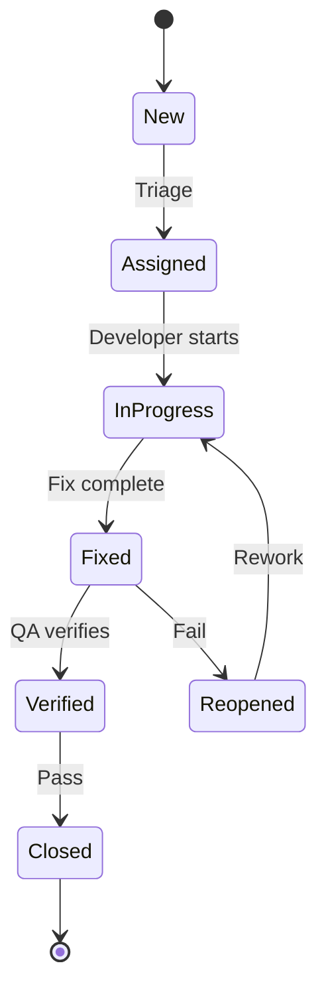

# Test Cases: [Feature Name]

## 1. Functional Inventory

### 1.1 Project Overview

| Field | Value |
|-------|-------|
| **Project** | [Project name] |
| **Project Type** | [REST API / Function Library / CLI Tool / Frontend App / AI Agent / Data Pipeline / SDK / etc.] |
| **Tech Stack** | [Language, framework, database (if any), etc.] |
| **Test Framework** | [Jest/pytest/Go test/JUnit/etc.] |
| **Scan Date** | [YYYY-MM-DD] |
| **Input Mode** | [Scan Mode / Code Mode / Spec Mode] |

### 1.2 Testable Units

| # | Unit Name | Type | File Path | Has Tests | Coverage Status |
|---|-----------|------|-----------|-----------|-----------------|
| 1 | [e.g., `parseConfig` / `GET /api/users` / `UserCard` / `deploy --env` / `web_search` tool] | [function / route / component / command / tool / pipeline / model] | [src/path/file.ts:42] | [Yes/No] | [Covered / Partial / None] |
| 2 | [...] | [...] | [...] | [...] | [...] |

### 1.3 Coverage Summary

| Metric | Value |
|--------|-------|
| Total testable units | [N] |
| Units with existing tests | [X] |
| Units without tests | [Y] |
| Current coverage | [X/N = Z%] |

### 1.4 Interaction Map

Units with dependencies or interaction relationships:

| Unit A | Relationship | Unit B | Risk Level |
|--------|-------------|--------|------------|
| [createOrder] | calls | [processPayment] | High |
| [web_search tool] | chains with | [web_fetch tool] | Medium |
| [UserForm] | submits to | [POST /api/users] | Medium |
| [parse] | pipes to | [transform] | Low |

## 2. Test Strategy

### 2.1 Test Pyramid

| Level | Target % | Rationale |
|-------|----------|-----------|
| Unit (Pure Logic) | [X%] | [Why — reference project characteristics] |
| Unit (I/O-Touching) | [X%] | [Why — reference I/O complexity (DB, file system, network, etc.)] |
| Integration | [X%] | [Why — reference integration boundaries] |
| System / E2E | [X%] | [Why — reference critical user journeys or workflows] |

### 2.2 External Dependency Policy

> **Adapt this section to your project.** Not all projects have databases. The principle is: **test your own dependencies for real; only mock what you don't control.**

| Scenario | Approach | Rationale |
|----------|----------|-----------|
| Pure functions (no I/O) | Direct unit test | No external dependency |
| Own database / data store | **Real** (TestContainers / test DB / in-memory) | Mocking hides query bugs, constraints, transactions |
| Own file system operations | **Real** (temp directory / in-memory FS) | Mocking hides path, permission, encoding issues |
| Own message queue / cache | **Real** (TestContainers / embedded) | Mocking hides serialization, ordering, TTL issues |
| External third-party APIs | **Mock / Stub** | External service may be unavailable or rate-limited |
| Non-deterministic inputs | **Inject controlled values** | Time, random, UUIDs — inject for determinism |

<!-- If the project has NO database or external I/O, simplify or omit this section -->

### 2.3 Test Methods

| Method | Applied To | Techniques |
|--------|-----------|------------|
| Black-Box | [Functional, acceptance, E2E tests] | Equivalence partitioning, BVA, decision tables |
| White-Box | [Unit tests, coverage analysis] | Statement coverage, branch coverage |
| Gray-Box | [Integration, API, security tests] | Partial internal knowledge for targeted testing |

### 2.4 Risk-Based Prioritization

| Risk Area | Likelihood | Impact | Priority | Rationale |
|-----------|-----------|--------|----------|-----------|
| [Area 1] | [H/M/L] | [H/M/L] | P0 | [Why — cite concrete factor] |
| [Area 2] | [H/M/L] | [H/M/L] | P1 | [Why] |
| [Area 3] | [H/M/L] | [H/M/L] | P2 | [Why] |

## 3. Dimensions

### 3.1 Coverage Depth (Built-in)

| Level | Name | Description |
|-------|------|-------------|
| L1 | Happy Path | Basic correct behavior with valid inputs |
| L2 | Boundary & Error | Edge cases, invalid inputs, error handling |
| L3 | Negative | Scenarios that should NOT trigger behavior |

### 3.2 Auto-Detected Dimensions

[List each detected dimension with its values and rationale for inclusion]

| Dimension | Values | Rationale |
|-----------|--------|-----------|
| [e.g., Auth Context] | [anonymous, user, admin] | [Auth patterns detected in middleware] |
| [e.g., Trigger Mode] | [single, combo] | [Tool calling patterns with combination logic] |
| [e.g., Input Source] | [args, stdin, config file] | [CLI accepts multiple input methods] |
| [e.g., Output Format] | [json, table, plain] | [CLI supports multiple output formats] |

### 3.3 Coverage Matrix Framework

[Cross-product of testable units × dimensions × depth levels. This frame is filled in Section 7 after cases are generated.]

## 4. Test Cases — Single Unit

> **Organization**: Sections 4.1-4.3 organize by coverage depth (L1/L2/L3) for general functional tests. Sections 4.4-4.6 organize by specialized category — include only those relevant to your project type. A test case appears in ONE section only; its Dimensions column indicates all applicable tags.
>
> **Column guide** — adapt Preconditions, Steps, and Expected Result to your project type:
> | Project Type | Preconditions | Steps | Expected Result |
> |-------------|---------------|-------|-----------------|
> | REST API | DB state, auth token, config | HTTP method + endpoint + body | HTTP status + response body + DB state after |
> | Function/Library | Input data, module state | Function call with args | Return value, thrown error, side effects |
> | CLI Tool | File system state, env vars | Command with flags/args | Exit code + stdout/stderr + file changes |
> | Frontend Component | Props, store state, DOM | User interaction (click, type, navigate) | Rendered output, emitted events, store changes |
> | AI Tool Calling | Conversation context, available tools | User message | Tool(s) triggered, parameters passed, response |
> | Data Pipeline | Input dataset, config | Pipeline execution | Output dataset, transformation correctness |

### 4.1 Happy Path (L1)

| TC ID | Module | Title | Dimensions | Preconditions | Steps | Expected Result | Not Expected | Priority | Test Infra | Automation |
|-------|--------|-------|------------|---------------|-------|-----------------|-------------|----------|------------|------------|
| TC-[MOD]-001 | [Module] | [action] [condition] [expected outcome] | L1 | **State**: [Exact initial state — DB records / files / context / props]<br/>**Auth/Env**: [Credentials / env vars / config if applicable] | 1. [Exact action with concrete values]<br/>2. [Execute / submit / invoke] | **Output**: [Return value / response / stdout / rendered result]<br/>**State After**: [Changed state — DB / files / store / context] | [What should NOT happen] | P0 | [Real DB / Temp dir / Mock external / N/A] | [Status] |

**Examples by project type** (pick the pattern that matches your project):

<!-- REST API example -->
<!-- TC-USR-001 | Users | Create user with valid data returns 201 | L1 | **DB State**: No user with email "test@example.com"<br/>**Auth**: Admin token | 1. POST /api/users with `{name: "John", email: "test@example.com"}`<br/>2. Submit | **Output**: HTTP 201, body contains `{id, name, email}`<br/>**State After**: Query `users` WHERE email='test@example.com' → 1 row | Should NOT create duplicate on retry | P0 | Real DB | to-be-automated -->

<!-- Function library example -->
<!-- TC-PARSE-001 | Parser | parseConfig with valid YAML returns config object | L1 | **Input**: Valid YAML string `"port: 8080\nhost: localhost"` | 1. Call `parseConfig(yamlString)`<br/>2. Check return value | **Output**: Returns `{port: 8080, host: "localhost"}`<br/>**State After**: No side effects | Should NOT modify input string | P0 | N/A | automated -->

<!-- CLI tool example -->
<!-- TC-CLI-001 | Deploy | deploy --env staging succeeds | L1 | **Files**: Valid config at ./deploy.yml<br/>**Env**: AWS_PROFILE=test set | 1. Run `mycli deploy --env staging`<br/>2. Check exit code and stdout | **Output**: Exit 0, stdout contains "Deployed to staging"<br/>**State After**: deployment.lock file created | Should NOT deploy to production | P0 | Temp dir | automated -->

<!-- AI tool calling example -->
<!-- TC-TOOL-001 | Search | "What's the weather in Tokyo?" triggers weather_fetch | L1 | **Context**: New conversation, user location Tokyo | 1. User sends "What's the weather in Tokyo?"<br/>2. Observe tool calls | **Output**: weather_fetch called with location="Tokyo"<br/>**State After**: Response includes temperature data | Should NOT trigger web_search | P0 | N/A | automated -->

### 4.2 Boundary & Error (L2)

| TC ID | Module | Title | Dimensions | Preconditions | Steps | Expected Result | Not Expected | Priority | Test Infra | Automation |
|-------|--------|-------|------------|---------------|-------|-----------------|-------------|----------|------------|------------|
| TC-[MOD]-010 | [Module] | [input] at minimum valid value accepted | L2 | **State**: [...] | 1. [Action with minimum valid input, e.g., `name: "a"`, `count: 0`, empty list `[]`]<br/>2. Execute | **Output**: [Success — accepted]<br/>**State After**: [Correct state with min value] | Should NOT reject valid minimum | P1 | [...] | [Status] |
| TC-[MOD]-011 | [Module] | [input] below minimum rejected | L2 | **State**: [...] | 1. [Action with below-min input, e.g., `name: ""`, `count: -1`, null]<br/>2. Execute | **Output**: [Error — validation failure with clear message] | Should NOT silently accept | P1 | [...] | [Status] |
| TC-[MOD]-012 | [Module] | [input] above maximum rejected | L2 | **State**: [...] | 1. [Action with above-max input, e.g., 256-char string, MAX_INT+1] | **Output**: [Error — validation failure] | Should NOT truncate and accept silently | P1 | [...] | [Status] |
| TC-[MOD]-013 | [Module] | [action] with missing required input returns error | L2 | **State**: [...] | 1. [Action with required field/arg omitted] | **Output**: [Error — clear message identifying missing input] | Should NOT use default value silently | P0 | [...] | [Status] |
| TC-[MOD]-014 | [Module] | [action] with wrong input type returns error | L2 | **State**: [...] | 1. [Action with wrong type, e.g., string for number, object for array] | **Output**: [Error — type mismatch message] | Should NOT coerce type silently | P1 | [...] | [Status] |

### 4.3 Negative (L3)

| TC ID | Module | Title | Dimensions | Preconditions | Steps | Expected Result | Not Expected | Priority | Test Infra | Automation |
|-------|--------|-------|------------|---------------|-------|-----------------|-------------|----------|------------|------------|
| TC-[MOD]-030 | [Module] | [action] should NOT trigger when [condition] | L3 | [State where behavior should not occur] | 1. [Action that looks like it might trigger but shouldn't]<br/>2. Observe | **Output**: [No action taken / different behavior / silent pass-through] | Should NOT [describe the incorrect trigger] | P1 | [...] | [Status] |

### 4.4 Data Integrity

<!-- INCLUDE THIS SECTION ONLY if the project uses a database or persistent data store -->

| TC ID | Module | Title | Dimensions | Preconditions | Steps | Expected Result | Not Expected | Priority | Test Infra | Automation |
|-------|--------|-------|------------|---------------|-------|-----------------|-------------|----------|------------|------------|
| TC-[MOD]-040 | [Module] | Unique constraint prevents duplicate [field] | L2, Data Integrity | **State**: Record exists with [field]="[value]" | 1. [Attempt to create record with same unique value]<br/>2. Execute | **Output**: [Conflict error]<br/>**State After**: Only one record exists | Should NOT create duplicate | P0 | Real DB | [Status] |
| TC-[MOD]-041 | [Module] | Foreign key prevents orphan records | L2, Data Integrity | **State**: No parent with id="[parent_id]" | 1. [Create child referencing nonexistent parent]<br/>2. Execute | **Output**: [Referential integrity error]<br/>**State After**: No child created | Should NOT create orphan record | P0 | Real DB | [Status] |
| TC-[MOD]-042 | [Module] | Cascade delete removes children | L2, Data Integrity | **State**: Parent with 3 children | 1. [Delete parent]<br/>2. Execute | **Output**: [Success]<br/>**State After**: Parent AND children deleted | Should NOT leave orphan children | P0 | Real DB | [Status] |
| TC-[MOD]-043 | [Module] | Transaction rollback on partial failure | L2, Data Integrity | **State**: [Initial state] | 1. [Multi-step operation where step 2 fails]<br/>2. Execute | **Output**: [Error]<br/>**State After**: ALL changes rolled back to initial state | Should NOT leave partial state | P0 | Real DB | [Status] |
| TC-[MOD]-044 | [Module] | Concurrent update with optimistic locking | L2, Data Integrity | **State**: Record with version=1 | 1. Read record (version=1)<br/>2. Concurrent update changes version to 2<br/>3. Update with stale version=1 | **Output**: [Conflict error]<br/>**State After**: version=2 data preserved | Should NOT silently overwrite | P1 | Real DB | [Status] |
| TC-[MOD]-045 | [Module] | Soft delete sets deleted_at without removing record | L2, Data Integrity | **State**: Active record exists | 1. [Delete record]<br/>2. Execute | **Output**: [Success]<br/>**State After**: Record exists with deleted_at set, excluded from normal queries | Should NOT physically remove record | P1 | Real DB | [Status] |
| TC-[MOD]-046 | [Module] | NOT NULL constraint rejects null for required field | L2, Data Integrity | **State**: [...] | 1. [Create record with required field = null]<br/>2. Execute | **Output**: [Constraint violation error]<br/>**State After**: No record created | Should NOT save record with null in required field | P0 | Real DB | [Status] |

### 4.5 Security

<!-- INCLUDE THIS SECTION if the project handles authentication, authorization, or user input that could be exploited -->

| TC ID | Module | Title | Dimensions | Preconditions | Steps | Expected Result | Not Expected | Priority | Test Infra | Automation |
|-------|--------|-------|------------|---------------|-------|-----------------|-------------|----------|------------|------------|
| TC-[MOD]-050 | [Module] | [action] without credentials is denied | L2, Security | **Auth/Env**: No credentials | 1. [Attempt action without auth — no token / no API key / no login]<br/>2. Execute | **Output**: [Access denied — 401 / permission error / exit 1] | Should NOT return data or perform action | P0 | [...] | [Status] |
| TC-[MOD]-051 | [Module] | [action] with insufficient permissions is denied | L2, Security | **Auth/Env**: Low-privilege user/role | 1. [Attempt privileged action with low-privilege credentials]<br/>2. Execute | **Output**: [Forbidden — 403 / permission error] | Should NOT perform the privileged action | P0 | [...] | [Status] |
| TC-[MOD]-052 | [Module] | Injection attempt is rejected | L3, Security | **Auth/Env**: Valid credentials | 1. [Inject malicious input — SQL: `"'; DROP TABLE x; --"` / CLI: `"; rm -rf /"` / XSS: `"<script>alert(1)</script>"`]<br/>2. Execute | **Output**: [Validation error or sanitized output]<br/>**State After**: No damage to any resource | Should NOT execute injected payload | P0 | [...] | [Status] |

### 4.6 Performance

<!-- INCLUDE THIS SECTION if the project has performance-sensitive operations -->

| TC ID | Module | Title | Dimensions | Preconditions | Steps | Expected Result | Not Expected | Priority | Test Infra | Automation |
|-------|--------|-------|------------|---------------|-------|-----------------|-------------|----------|------------|------------|
| TC-[MOD]-060 | [Module] | [operation] completes within [X]ms under [Y] concurrent load | L2, Performance | **State**: [Realistic data volume / realistic input size]<br/>**Environment**: [Production-like] | 1. Configure load: [Y] concurrent [requests/calls/invocations], [Z] duration<br/>2. Execute against [target]<br/>3. Collect p50, p95, p99 | **p95**: <= [X]ms<br/>**Error rate**: < [Z]%<br/>**Throughput**: >= [N] ops/s | Should NOT exceed p99 threshold or cause errors under normal load | P1 | [...] | [Status] |

## 5. Test Cases — Combination

### 5.1 Unit Interaction Tests

| TC ID | Units Involved | Title | Dimensions | Preconditions | Steps | Expected Result | Not Expected | Priority | Test Infra | Automation |
|-------|---------------|-------|------------|---------------|-------|-----------------|-------------|----------|------------|------------|
| TC-COMBO-001 | [Unit A] → [Unit B] | [A succeeds] then [B processes result correctly] | L1, Combo | [Combined preconditions] | 1. [Trigger Unit A with valid input]<br/>2. [Verify Unit A output]<br/>3. [Unit B receives A's output]<br/>4. [Verify final state] | **Output**: [End-to-end expected result]<br/>**State After**: [Final state verification] | [What should NOT happen in the chain] | P0 | [...] | [Status] |
| TC-COMBO-002 | [Unit A] → [Unit B] | [A fails] and [B handles error gracefully] | L2, Combo | [Preconditions causing A to fail] | 1. [Trigger Unit A with input causing failure]<br/>2. [Verify A's error]<br/>3. [Verify B's error handling behavior] | **Output**: [Graceful degradation]<br/>**State After**: [No partial corruption] | Should NOT leave inconsistent state | P1 | [...] | [Status] |
| TC-COMBO-003 | [Unit A] + [Unit B] | [A and B should NOT both trigger for this input] | L3, Combo | [Ambiguous input state] | 1. [Input that might trigger both]<br/>2. Observe which triggers | **Output**: [Only correct unit triggers] | Should NOT trigger both / wrong unit | P1 | [...] | [Status] |

### 5.2 Cross-Module Integration Tests

[For interactions spanning multiple modules — same table format as 5.1]

## 6. Test Cases — Dimension-Specific

[For each auto-detected dimension, generate targeted test cases]

### 6.1 [Dimension Name] Tests

| TC ID | Module | Title | Dimensions | Preconditions | Steps | Expected Result | Not Expected | Priority | Test Infra | Automation |
|-------|--------|-------|------------|---------------|-------|-----------------|-------------|----------|------------|------------|
| TC-[MOD]-070 | [Module] | [action] under [dimension value 1] | L1, [Dim:Value1] | [...] | [...] | [...] | [...] | [...] | [...] | [...] |
| TC-[MOD]-071 | [Module] | [action] under [dimension value 2] | L1, [Dim:Value2] | [...] | [...] | [...] | [...] | [...] | [...] | [...] |

[Repeat for each detected dimension]

## 7. Coverage Matrix

### 7.1 Unit × Depth Coverage

| Testable Unit | L1 (Happy) | L2 (Boundary/Error) | L3 (Negative) | Total |
|---------------|-----------|-------------------|--------------|-------|
| [Unit 1] | TC-XXX-001 | TC-XXX-010, TC-XXX-011 | TC-XXX-030 | 4 |
| [Unit 2] | TC-XXX-002 | TC-XXX-012, TC-XXX-013 | TC-XXX-031 | 4 |
| **Gap Check** | [Any unit with 0 in a column = GAP — must be addressed] |

### 7.2 Dimension Coverage

[For each auto-detected dimension]

| [Dimension] Value | L1 | L2 | L3 | Total |
|-------------------|----|----|----|----|
| [Value 1] | [count] | [count] | [count] | [count] |
| [Value 2] | [count] | [count] | [count] | [count] |

### 7.3 Combination Coverage

| Interaction Pair | L1 (Both OK) | L2 (One Fails) | L3 (Should Not Combine) | Total |
|-----------------|-------------|----------------|------------------------|-------|
| [A → B] | TC-COMBO-001 | TC-COMBO-002 | TC-COMBO-003 | 3 |

### 7.4 Category Distribution

| Category | Count | Percentage |
|----------|-------|-----------|
| Functional | [N] | [X%] |
| Data Integrity | [N] | [X%] |
| Security | [N] | [X%] |
| Performance | [N] | [X%] |
| **Total** | **[N]** | **100%** |

<!-- Omit rows for categories not applicable to this project (e.g., Data Integrity if no DB) -->

### 7.5 Priority Distribution

| Priority | Count | Percentage |
|----------|-------|-----------|
| P0 (Critical) | [N] | [X%] |
| P1 (Important) | [N] | [X%] |
| P2 (Nice-to-have) | [N] | [X%] |
| **Total** | **[N]** | **100%** |

### 7.6 Gap Analysis

| Gap Type | Details | Recommendation |
|----------|---------|---------------|
| [Unit without L3] | [Unit name has no negative test case] | [Add TC-XXX-03X] |
| [Dimension uncovered] | [Dimension value X has no L2 cases] | [Add boundary test for value X] |
| [Interaction untested] | [A → C interaction has no combination test] | [Add TC-COMBO-XXX] |

## 8. Requirements Traceability Matrix

[Only if upstream SRS/Tech Design exists]

| Requirement ID | Description | Test Case IDs | Coverage |
|---------------|-------------|---------------|----------|
| FR-[MOD]-001 | [Description] | TC-[MOD]-001, TC-[MOD]-010 | Covered |
| NFR-[CAT]-001 | [Description] | TC-[MOD]-060 | Covered |
| FR-[MOD]-003 | [Description] | — | **Not Covered** — [explain and plan] |

[If no upstream docs:]

> **Note**: No upstream SRS/Tech Design found. This matrix maps test cases to the functional inventory instead. For full requirement traceability, generate requirements first with `/spec-forge:srs`.

## 9. Statistics

| Metric | Value |
|--------|-------|
| Total test cases | [N] |
| Testable units covered | [X / Y] |
| L1 (Happy Path) cases | [N] |
| L2 (Boundary/Error) cases | [N] |
| L3 (Negative) cases | [N] |
| Combination cases | [N] |
| Data Integrity cases | [N] |
| Security cases | [N] |
| Performance cases | [N] |
| Gaps identified | [N] |

---

<!-- FORMAL MODE SECTIONS — Only include when --formal flag is set -->

## F1. Document Information

| Field | Value |
|-------|-------|
| **Document Title** | Test Cases — [Feature Name] |
| **Version** | 0.1 |
| **Author** | [Author Name] |
| **Reviewers** | [Reviewer 1, Reviewer 2] |
| **Date** | [YYYY-MM-DD] |
| **Status** | Draft |
| **Related SRS** | [docs/{feature}/srs.md, version X.X] |
| **Related Tech Design** | [docs/{feature}/tech-design.md, version X.X] |

## F2. Revision History

| Version | Date | Author | Description |
|---------|------|--------|-------------|
| 0.1 | [YYYY-MM-DD] | [Author Name] | Initial draft |

## F3. Test Environment

### F3.1 Hardware Requirements

| Component | Specification | Purpose |
|-----------|--------------|---------|
| [Server/VM] | [CPU, RAM, Storage] | [Application hosting] |

### F3.2 Software Requirements

| Software | Version | Purpose |
|----------|---------|---------|
| [Runtime] | [Version] | [Execution environment] |
| [Test Framework] | [Version] | [Test execution] |

### F3.3 Network Configuration

[VPN, firewall, API gateway, SSL, sandbox endpoints — omit if not applicable]

## F4. Entry and Exit Criteria

### F4.1 Entry Criteria

- [ ] Code complete for in-scope features
- [ ] Build passing in CI
- [ ] Unit tests passing with minimum coverage
- [ ] Test data / fixtures prepared

### F4.2 Exit Criteria

- [ ] All P0 test cases executed and passed
- [ ] All P1 test cases with pass rate >= 95%
- [ ] No open Critical defects
- [ ] Coverage matrix shows no gaps for in-scope units

## F5. Test Data Management

- **Creation**: [Seed scripts / factories / fixtures / synthetic generation]
- **Isolation**: [Transaction rollback / temp directories / container per suite / fresh context]
- **Cleanup**: [Auto-rollback / afterEach hooks / container auto-destroy / temp dir cleanup]
- **Sensitive data**: [PII handling approach — if applicable]

## F6. Defect Management

### F6.1 Severity Classification

| Severity | Description | Response Time |
|----------|-------------|---------------|
| Critical | System crash, data loss, security breach | Immediate |
| Major | Feature malfunction, difficult workaround | [X] business days |
| Minor | Cosmetic issue, easy workaround | [X] business days |
| Trivial | Typo, minor UI misalignment | Next release |

### F6.2 Defect Lifecycle



## F7. Risk Assessment

### F7.1 Testing Risks

| Risk | Likelihood | Impact | Mitigation |
|------|-----------|--------|------------|
| [Risk 1] | [H/M/L] | [H/M/L] | [Strategy] |

### F7.2 Product Risks

| Risk Area | Description | Likelihood | Impact | Test Approach |
|-----------|------------|-----------|--------|--------------|
| [Area 1] | [Description] | [H/M/L] | [H/M/L] | [Approach] |

## F8. Test Schedule

```mermaid
gantt
    title Test Execution Schedule
    dateFormat  YYYY-MM-DD
    section Preparation
    Test case review        :a1, [start], [duration]
    Environment setup       :a2, after a1, [duration]
    section Execution
    Unit testing            :b1, after a2, [duration]
    Integration testing     :b2, after b1, [duration]
    System testing          :b3, after b2, [duration]
    section Closure
    Defect resolution       :c1, after b3, [duration]
    Regression testing      :c2, after c1, [duration]
```

## F9. Roles and Responsibilities

| Role | Person | Responsibilities |
|------|--------|-----------------|
| Test Lead | [Name] | Planning, coordination, reporting |
| QA Engineer | [Name] | Case design, execution, automation |
| Developer | [Name] | Unit testing, defect resolution |
| Product Owner | [Name] | Acceptance criteria, sign-off |
