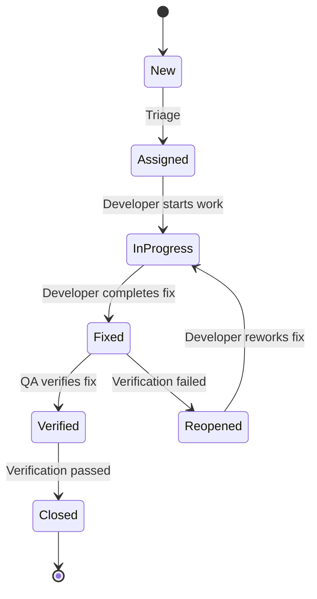

# Test Plan: [Feature Name]

## 1. Document Information

| Field               | Value                                         |
|---------------------|-----------------------------------------------|
| **Document Title**  | Test Plan -- [Feature Name]                   |
| **Version**         | 0.1                                           |
| **Author**          | [Author Name]                                 |
| **Reviewers**       | [Reviewer 1, Reviewer 2]                      |
| **Date**            | [YYYY-MM-DD]                                  |
| **Status**          | Draft                                         |
| **Related SRS**     | [docs/{feature}/srs.md, version X.X]       |
| **Related Tech Design** | [docs/{feature}/tech-design.md, version X.X] |

## 2. Revision History

| Version | Date       | Author        | Description          |
|---------|------------|---------------|----------------------|
| 0.1     | [YYYY-MM-DD] | [Author Name] | Initial draft     |

## 3. Introduction

### 3.1 Purpose

[Describe the purpose of this Test Plan. Explain what feature or system is being tested and what this document aims to achieve. State the intended audience -- QA engineers, developers, product owners, and project managers.]

### 3.2 Scope

[Describe the scope of testing. Identify the features, modules, and user flows that are covered by this Test Plan. Briefly mention what is excluded and why.]

### 3.3 References

| Document                     | Version | Date       |
|------------------------------|---------|------------|
| Software Requirements Specification (SRS) | [X.X] | [YYYY-MM-DD] |
| Technical Design Document    | [X.X]   | [YYYY-MM-DD] |
| Product Requirements Document (PRD) | [X.X] | [YYYY-MM-DD] |
| [Additional reference]       | [X.X]   | [YYYY-MM-DD] |

### 3.4 Definitions, Acronyms, and Abbreviations

| Term   | Definition                                      |
|--------|-------------------------------------------------|
| SRS    | Software Requirements Specification             |
| TC     | Test Case                                       |
| RTM    | Requirements Traceability Matrix                |
| UAT    | User Acceptance Testing                         |
| E2E    | End-to-End                                      |
| BVA    | Boundary Value Analysis                         |
| CI/CD  | Continuous Integration / Continuous Deployment   |
| [Term] | [Definition]                                    |

## 4. Test Strategy

### 4.1 Test Levels

| Level       | Description                                                                 | Responsibility     | Tools                  | Automation % | DB Approach |
|-------------|-----------------------------------------------------------------------------|--------------------|-----------------------|-------------|-------------|
| Unit (Pure Logic) | [Test pure functions/methods with NO database dependency — business calculations, validations, transformations, utilities] | Developers | [Jest/pytest/JUnit] | [95-100%] | N/A — no DB involved |
| Unit (DB-Touching) | [Test any method that reads/writes database — repositories, services with queries, data access layer. **Use real database, NOT mocks**] | Developers | [Jest+TestContainers/pytest+testcontainers/JUnit+TestContainers] | [90-100%] | **Real DB (TestContainers / test DB instance)** |
| Integration | [Test component interaction — API endpoints, service-to-service, message queue consumers. **Always use real database**] | Developers / QA | [Supertest+TestContainers/httptest+testcontainers] | [70-90%] | **Real DB (TestContainers / test DB instance)** |
| System      | [Full application workflow verification in production-like environment]       | QA Engineers       | [Cypress/Playwright]  | [50-70%]    | **Real DB (dedicated test environment)** |
| Acceptance  | [Business requirements verification with real data scenarios]                | QA / Product Owner | [Cucumber/Manual]     | [20-50%]    | **Real DB (staging environment)** |

### 4.2 Test Types

| Type          | Description                                                        | Approach                                    | Priority |
|---------------|--------------------------------------------------------------------|--------------------------------------------|----------|
| Functional    | [Describe functional testing scope and objectives]                 | Black-box, equivalence partitioning, BVA   | P0       |
| Performance   | [Describe performance testing targets and load profiles]           | Load testing, stress testing, endurance     | P1       |
| Security      | [Describe security testing scope -- OWASP Top 10 coverage]        | Penetration testing, vulnerability scanning | P1       |
| Compatibility | [Describe target browsers, devices, and OS versions]               | Cross-browser, cross-device testing         | P1       |
| Regression    | [Describe regression testing strategy and automation approach]     | Automated test suite execution              | P0       |

### 4.3 Test Methods

**Black-Box Testing**

[Describe when and how black-box testing is applied. List techniques: equivalence partitioning, boundary value analysis, decision table testing, state transition testing. Specify which test levels and test types primarily use this method.]

**White-Box Testing**

[Describe when and how white-box testing is applied. List techniques: statement coverage, branch coverage, path coverage. Specify target coverage percentages and the tools used to measure them.]

**Gray-Box Testing**

[Describe when and how gray-box testing is applied. Explain how partial knowledge of internals improves test effectiveness for integration testing, API testing, and security testing.]

### 4.4 Database Testing Policy

**Principle: Any method that touches the database must be tested against a real database, not a mock.**

Mocking the database hides real issues: SQL syntax errors, constraint violations, transaction behavior, index performance, encoding issues, NULL handling, and ORM mapping bugs. Mocks give false confidence — tests pass, but the code is broken in production.

#### When to Use Real Database vs. Mock

| Scenario | Test Approach | Rationale |
|----------|--------------|-----------|
| Pure functions (no I/O) | No mock needed — unit test directly | No database dependency |
| Business logic calling repository | **Real DB** via TestContainers or test DB | Mock hides query bugs, constraint violations, transaction issues |
| Repository / Data Access Layer | **Real DB** via TestContainers or test DB | This IS the database code — mocking it means testing nothing |
| API endpoint that reads/writes data | **Real DB** via TestContainers or test DB | Must verify full request → query → response chain |
| Service-to-service integration | **Real DB** for data services; mock ONLY for external third-party APIs you don't control | External services may be unavailable; your own DB should always be real |
| Performance / load testing | **Real DB** matching production specs | Mock DB has zero latency — performance results would be meaningless |

#### Real Database Test Infrastructure

| Tool / Approach | Language / Framework | Description |
|----------------|---------------------|-------------|
| [TestContainers](https://testcontainers.com/) | Java, Go, Node.js, Python, .NET, Rust | Spin up real database in Docker per test suite; auto-cleanup after tests |
| SQLite in-memory | Python, Node.js, Go | Fast in-memory DB for simple schemas; limited to SQLite-compatible SQL |
| Dedicated test database | All | Shared test DB instance; use transactions for isolation (BEGIN → test → ROLLBACK) |
| Database per test suite | All | Create/destroy database per test suite; cleanest isolation, slower setup |
| [Describe project-specific approach] | [Framework] | [How this project handles test database lifecycle] |

#### Test Data Management for Real DB Tests

- **Setup**: [Describe how test data is seeded — migration scripts, factory functions, fixture files, or SQL seeds]
- **Isolation**: [Describe how tests are isolated — transaction rollback, truncate between tests, separate database per suite]
- **Cleanup**: [Describe cleanup strategy — auto-rollback, afterEach hooks, TestContainers auto-destroy]
- **Determinism**: [Describe how to ensure tests produce consistent results — fixed timestamps, deterministic IDs, controlled sequences]

### 4.5 What CAN Be Mocked (Exceptions)

Mocking is appropriate ONLY for:
- **External third-party APIs** you don't own (payment gateways, email services, SMS providers) — use contract testing + mocks
- **Non-deterministic inputs** (current time, random numbers) — inject controlled values
- **Expensive external resources** (cloud storage, ML inference) — mock the client, but also have a small suite of real integration tests
- **Network failure simulation** — mock the transport layer to test retry/circuit breaker logic

**Never mock**: Your own database, your own message queues, your own cache (Redis), your own services. If you wrote it and it's within your system boundary, test it for real.

## 5. Test Scope

### 5.1 In Scope

- [Feature/module 1 -- describe what aspects will be tested]
- [Feature/module 2 -- describe what aspects will be tested]
- [Feature/module 3 -- describe what aspects will be tested]
- [User flow 1 -- describe the end-to-end scenario]
- [User flow 2 -- describe the end-to-end scenario]
- [Non-functional aspect 1 -- e.g., response time under load]
- [Non-functional aspect 2 -- e.g., cross-browser compatibility]

### 5.2 Out of Scope

- [Feature/module -- justification for exclusion]
- [Test type -- justification for exclusion]
- [Environment/platform -- justification for exclusion]

## 6. Test Environment

### 6.1 Hardware Requirements

| Component       | Specification                          | Purpose              |
|-----------------|----------------------------------------|----------------------|
| [Server/VM]     | [CPU, RAM, Storage specifications]     | [Application hosting]|
| [Client machine] | [CPU, RAM, OS specifications]         | [Test execution]     |
| [Mobile device] | [Model, OS version]                    | [Mobile testing]     |

### 6.2 Software Requirements

| Software            | Version    | Purpose                    |
|---------------------|------------|----------------------------|
| [Operating System]  | [Version]  | [Host environment]         |
| [Browser]           | [Version]  | [UI testing]               |
| [Database]          | [Version]  | [Data layer testing]       |
| [Test Framework]    | [Version]  | [Test execution]           |
| [CI/CD Platform]    | [Version]  | [Automated pipeline]       |

### 6.3 Network Configuration

[Describe network requirements: VPN access, firewall rules, API gateway configuration, DNS settings, SSL certificates, and any third-party service sandbox endpoints needed for testing.]

### 6.4 Test Data Requirements

[Describe the approach to test data: synthetic data generation, anonymized production data, seed scripts, or fixture files. Specify any data sensitivity constraints and how test data isolation is maintained between test runs.]

## 7. Entry and Exit Criteria

### 7.1 Entry Criteria

- [ ] Code complete for all in-scope features
- [ ] Build successfully deployed to the test environment
- [ ] Unit tests passing with minimum coverage threshold ([X]%)
- [ ] SRS and Technical Design documents reviewed and approved
- [ ] Test environment provisioned and verified
- [ ] Test data prepared and loaded
- [ ] Test cases reviewed and approved
- [ ] All blocking defects from previous cycles resolved

### 7.2 Exit Criteria

- [ ] All P0 test cases executed and passed
- [ ] All P1 test cases executed with pass rate >= 95%
- [ ] No open Critical severity defects
- [ ] No more than [N] open Major severity defects with approved workarounds
- [ ] Requirements Traceability Matrix shows 100% coverage of in-scope requirements
- [ ] Performance benchmarks met (response time <= [X]ms at [Y] concurrent users)
- [ ] Security scan completed with no Critical or High vulnerabilities
- [ ] Test execution report reviewed and signed off by stakeholders

## 8. Test Case Specifications

This section is the core of the test plan. Each test case must be detailed enough that an engineer can directly translate it into test code. Every test case that touches a database MUST specify "Real DB" in the DB column — mock is only acceptable for external third-party services.

### 8.1 Test Case Writing Guide

Before writing test cases, follow these rules:

1. **One assertion per test case** — each test verifies exactly one behavior
2. **Descriptive title** — use the pattern: `[action] [condition] [expected outcome]` (e.g., "Create user with valid email returns 201 and saves to database")
3. **Preconditions include DB state** — specify exactly what data must exist in the database before the test runs
4. **Steps include exact values** — use concrete data, not placeholders (e.g., `email: "test@example.com"`, not `email: [valid email]`)
5. **Expected results verify DB state** — for any write operation, verify the database record was actually created/updated/deleted, not just the API response
6. **Specify DB approach per test** — mark whether the test uses Real DB or Mock (and justify if Mock)

### 8.2 Functional Test Cases — Happy Path

| TC ID | Module | Title | Preconditions | Steps | Expected Result | DB Verify | Priority | DB Approach | Automation |
|-------|--------|-------|---------------|-------|-----------------|-----------|----------|-------------|------------|
| TC-[MOD]-001 | [Module] | [action] [condition] returns [expected] | **DB State**: [Describe exact records that must exist in database]<br/>**Auth**: [User role/token required]<br/>**Config**: [Any feature flags or config] | 1. [Exact HTTP method + endpoint + headers]<br/>2. [Exact request body with concrete values]<br/>3. [Submit request] | **Response**: [Exact HTTP status + response body structure]<br/>**DB State After**: [Exact record created/updated — specify table, column values] | Query `[table]` WHERE `[condition]` → verify `[column]` = `[expected value]` | P0 | **Real DB** | [Status] |
| TC-[MOD]-002 | [Module] | [action] [condition] returns [expected] | **DB State**: [...]<br/>**Auth**: [...]  | 1. [...]<br/>2. [...]<br/>3. [...] | **Response**: [...]<br/>**DB State After**: [...] | Query `[table]` → verify [...] | P0 | **Real DB** | [Status] |
| TC-[MOD]-003 | [Module] | [action] [condition] returns [expected] | **DB State**: [...]<br/>**Auth**: [...]  | 1. [...]<br/>2. [...]<br/>3. [...] | **Response**: [...]<br/>**DB State After**: [...] | Query `[table]` → verify [...] | P1 | **Real DB** | [Status] |

### 8.3 Functional Test Cases — Error / Negative Path

| TC ID | Module | Title | Preconditions | Steps | Expected Result | DB Verify | Priority | DB Approach | Automation |
|-------|--------|-------|---------------|-------|-----------------|-----------|----------|-------------|------------|
| TC-[MOD]-010 | [Module] | [action] with [invalid condition] returns [error] | **DB State**: [...]<br/>**Auth**: [...] | 1. [Send request with specific invalid data — state exact invalid value]<br/>2. [Submit request] | **Response**: HTTP [status code], error code `[EXACT_ERROR_CODE]`, message contains "[key phrase]"<br/>**DB State After**: [No record created — verify table is unchanged] | Query `[table]` → verify record count unchanged | P0 | **Real DB** | [Status] |
| TC-[MOD]-011 | [Module] | [action] without auth returns 401 | **DB State**: [...]<br/>**Auth**: No token / expired token | 1. [Send request without Authorization header]<br/>2. [Submit request] | **Response**: HTTP 401, error code `AUTH_UNAUTHORIZED`<br/>**DB State After**: No changes | Verify no new records in `[table]` | P0 | **Real DB** | [Status] |
| TC-[MOD]-012 | [Module] | [action] with insufficient permissions returns 403 | **DB State**: [User exists with role=viewer]<br/>**Auth**: Viewer token | 1. [Send write request with viewer credentials]<br/>2. [Submit request] | **Response**: HTTP 403, error code `FORBIDDEN_INSUFFICIENT_ROLE`<br/>**DB State After**: No changes | Verify no mutations in `[table]` | P0 | **Real DB** | [Status] |
| TC-[MOD]-013 | [Module] | [action] on nonexistent resource returns 404 | **DB State**: [No record with id=nonexistent-id]<br/>**Auth**: Valid token | 1. [Send request with id="nonexistent-uuid"]<br/>2. [Submit request] | **Response**: HTTP 404, error code `NOT_FOUND_RESOURCE` | N/A | P1 | **Real DB** | [Status] |
| TC-[MOD]-014 | [Module] | [action] with external service failure returns [fallback] | **DB State**: [Valid records exist]<br/>**Auth**: Valid token<br/>**External**: [Service name] is unavailable | 1. [Configure external service mock to return timeout/500]<br/>2. [Send request]<br/>3. [Observe fallback behavior] | **Response**: [Describe graceful degradation — queued for retry / partial response / 503]<br/>**DB State After**: [Describe — e.g., record saved with status=pending] | Query `[table]` → verify status = `pending` | P1 | **Real DB** + Mock external service | [Status] |

### 8.4 Boundary Value Test Cases

| TC ID | Module | Title | Preconditions | Steps | Expected Result | DB Verify | Priority | DB Approach | Automation |
|-------|--------|-------|---------------|-------|-----------------|-----------|----------|-------------|------------|
| TC-[MOD]-020 | [Module] | [field] at minimum valid value ([exact value]) accepted | **DB State**: [...] | 1. [Send request with field = exact minimum value, e.g., `name: "a"` (1 char)]<br/>2. Submit | **Response**: HTTP 201/200<br/>**DB State After**: Record saved with field = "[exact value]" | Query `[table]` → verify `[field]` = `[exact value]` | P1 | **Real DB** | [Status] |
| TC-[MOD]-021 | [Module] | [field] at maximum valid value ([exact value]) accepted | **DB State**: [...] | 1. [Send request with field = exact max value, e.g., `name: "a" * 255` (255 chars)]<br/>2. Submit | **Response**: HTTP 201/200<br/>**DB State After**: Record saved with field at max length | Query `[table]` → verify length(`[field]`) = [max] | P1 | **Real DB** | [Status] |
| TC-[MOD]-022 | [Module] | [field] below minimum ([exact value]) rejected | **DB State**: [...] | 1. [Send request with field = below min, e.g., `name: ""` (0 chars)]<br/>2. Submit | **Response**: HTTP 400, error code `VALIDATION_ERROR`, details include field "[field]" and message "[exact error message]"<br/>**DB State After**: No record created | Verify record count unchanged | P1 | **Real DB** | [Status] |
| TC-[MOD]-023 | [Module] | [field] above maximum ([exact value]) rejected | **DB State**: [...] | 1. [Send request with field = above max, e.g., `name: "a" * 256` (256 chars)]<br/>2. Submit | **Response**: HTTP 400, error code `VALIDATION_ERROR`<br/>**DB State After**: No record created | Verify record count unchanged | P1 | **Real DB** | [Status] |
| TC-[MOD]-024 | [Module] | [numeric field] at zero accepted/rejected | **DB State**: [...] | 1. [Send request with numeric field = 0]<br/>2. Submit | **Response**: [HTTP 201 if 0 is valid / HTTP 400 if 0 is invalid]<br/>**DB State After**: [Record saved with field=0 / No record] | Query → verify | P1 | **Real DB** | [Status] |
| TC-[MOD]-025 | [Module] | [numeric field] negative value rejected | **DB State**: [...] | 1. [Send request with numeric field = -1]<br/>2. Submit | **Response**: HTTP 400, validation error | Verify no record | P1 | **Real DB** | [Status] |

### 8.5 Data Integrity Test Cases

These tests specifically verify database-level correctness that CANNOT be caught by mocking.

| TC ID | Module | Title | Preconditions | Steps | Expected Result | DB Verify | Priority | DB Approach | Automation |
|-------|--------|-------|---------------|-------|-----------------|-----------|----------|-------------|------------|
| TC-[MOD]-040 | [Module] | Unique constraint prevents duplicate [field] | **DB State**: Record exists with [field]="[value]" | 1. [Send create request with same unique field value]<br/>2. Submit | **Response**: HTTP 409 Conflict<br/>**DB State After**: Only one record with this value | Query `[table]` WHERE `[field]` = `[value]` → count = 1 | P0 | **Real DB** | [Status] |
| TC-[MOD]-041 | [Module] | Foreign key constraint prevents orphan records | **DB State**: No parent record with id="[parent_id]" | 1. [Send create request referencing nonexistent parent_id]<br/>2. Submit | **Response**: HTTP 400/422 with referential integrity error<br/>**DB State After**: No child record created | Verify no record in child table | P0 | **Real DB** | [Status] |
| TC-[MOD]-042 | [Module] | Cascade delete removes child records | **DB State**: Parent record with 3 child records | 1. [Send DELETE request for parent record]<br/>2. Submit | **Response**: HTTP 200/204<br/>**DB State After**: Parent AND all child records deleted | Query parent table → 0 rows; Query child table → 0 rows for this parent | P0 | **Real DB** | [Status] |
| TC-[MOD]-043 | [Module] | Transaction rollback on partial failure | **DB State**: [Initial state] | 1. [Send request that triggers multi-step operation where step 2 fails]<br/>2. Submit | **Response**: HTTP 500/422<br/>**DB State After**: ALL changes rolled back — database is in original state | Query all affected tables → verify state matches precondition | P0 | **Real DB** | [Status] |
| TC-[MOD]-044 | [Module] | Concurrent update with optimistic locking | **DB State**: Record with version=1 | 1. [Read record (version=1)]<br/>2. [Simulate concurrent update that changes version to 2]<br/>3. [Send update with stale version=1] | **Response**: HTTP 409 Conflict<br/>**DB State After**: Record has version=2 (concurrent update wins) | Query `[table]` → verify version = 2 and data = concurrent update's data | P1 | **Real DB** | [Status] |
| TC-[MOD]-045 | [Module] | Soft delete sets deleted_at without removing record | **DB State**: Active record exists | 1. [Send DELETE request]<br/>2. Submit | **Response**: HTTP 200/204<br/>**DB State After**: Record still exists with deleted_at = [timestamp], not physically removed | Query `[table]` WITH deleted → verify deleted_at IS NOT NULL | P1 | **Real DB** | [Status] |

### 8.6 Performance Test Cases

| TC ID | Module | Title | Preconditions | Steps | Expected Result | Priority | DB Approach | Automation |
|-------|--------|-------|---------------|-------|-----------------|----------|-------------|------------|
| TC-[MOD]-050 | [Module] | [Endpoint] responds within [X]ms under [Y] concurrent users | **DB State**: [Realistic data volume — e.g., 100K records in table]<br/>**Environment**: [Production-like specs] | 1. Configure load profile: [Y] concurrent users, [Z] duration<br/>2. Execute load test against [endpoint]<br/>3. Collect p50, p95, p99 latency, throughput, error rate | **p50**: <= [X]ms<br/>**p95**: <= [X*3]ms<br/>**p99**: <= [X*10]ms<br/>**Error rate**: < [Z]%<br/>**Throughput**: >= [N] req/s | P1 | **Real DB (production-like data volume)** | [Status] |
| TC-[MOD]-051 | [Module] | [Query] performs acceptably with [N] records | **DB State**: Table contains [N] records (e.g., 1M rows) | 1. Execute [specific query/API call]<br/>2. Measure query execution time | **Query time**: < [X]ms<br/>**Explain plan**: Uses index [index_name], no full table scan | P1 | **Real DB** | [Status] |

## 9. Test Data Requirements

### 9.1 Test Data Sets

| Data Set         | Description                                    | Source                    | Sensitivity |
|------------------|------------------------------------------------|---------------------------|-------------|
| [Data set 1]     | [Describe the data set and its purpose]        | [Synthetic/Anonymized/Fixture] | [High/Medium/Low] |
| [Data set 2]     | [Describe the data set and its purpose]        | [Synthetic/Anonymized/Fixture] | [High/Medium/Low] |
| [Data set 3]     | [Describe the data set and its purpose]        | [Synthetic/Anonymized/Fixture] | [High/Medium/Low] |

### 9.2 Test Data Management

[Describe the strategy for creating, maintaining, and cleaning up test data. Address the following:]

- **Data creation**: [Describe how test data is generated -- seed scripts, factories, manual creation]
- **Data isolation**: [Describe how test runs are isolated to prevent data pollution between tests]
- **Data refresh**: [Describe how and when test data is refreshed or reset]
- **Sensitive data handling**: [Describe measures to protect PII and other sensitive data in test environments]

## 10. Defect Management

### 10.1 Severity Classification

| Severity | Description                                                          | Response Time | Examples                                      |
|----------|----------------------------------------------------------------------|---------------|-----------------------------------------------|
| Critical | System crash, data loss, security breach, or complete feature failure with no workaround | [Immediate / within X hours] | [Describe example: application crash on login, payment data exposure] |
| Major    | Significant feature malfunction or performance degradation with difficult workaround | [Within X business days] | [Describe example: checkout flow fails for specific payment method] |
| Minor    | Cosmetic issue or edge case failure with easy workaround              | [Within X business days] | [Describe example: date format inconsistency, tooltip text truncated] |
| Trivial  | Typographical error, minor UI misalignment, or improvement suggestion | [Next release cycle] | [Describe example: typo in footer text, slight color mismatch] |

### 10.2 Defect Lifecycle



### 10.3 Defect Reporting Template

Each defect report must include the following information:

- **Defect ID**: [Auto-generated by defect tracking tool]
- **Title**: [Concise description of the defect]
- **Severity**: [Critical / Major / Minor / Trivial]
- **Priority**: [P0 / P1 / P2]
- **Module**: [Affected module or component]
- **Environment**: [OS, browser, device, build version]
- **Steps to Reproduce**: [Numbered steps to reliably reproduce the defect]
- **Expected Result**: [What should happen]
- **Actual Result**: [What actually happens]
- **Attachments**: [Screenshots, logs, videos]
- **Related Test Case**: [TC ID that discovered the defect]

## 11. Risk Assessment

### 11.1 Testing Risks

| Risk                                          | Likelihood | Impact | Mitigation                                          |
|-----------------------------------------------|------------|--------|-----------------------------------------------------|
| [Test environment instability]                | [H/M/L]   | [H/M/L]| [Describe mitigation strategy]                      |
| [Insufficient test data]                      | [H/M/L]   | [H/M/L]| [Describe mitigation strategy]                      |
| [Resource unavailability]                     | [H/M/L]   | [H/M/L]| [Describe mitigation strategy]                      |
| [Third-party service downtime]                | [H/M/L]   | [H/M/L]| [Describe mitigation strategy]                      |
| [Scope creep during testing phase]            | [H/M/L]   | [H/M/L]| [Describe mitigation strategy]                      |

### 11.2 Product Risks

| Risk Area       | Risk Description                                       | Test Approach                                |
|-----------------|--------------------------------------------------------|----------------------------------------------|
| [Risk area 1]   | [Describe the product risk]                            | [Describe test approach to mitigate]         |
| [Risk area 2]   | [Describe the product risk]                            | [Describe test approach to mitigate]         |
| [Risk area 3]   | [Describe the product risk]                            | [Describe test approach to mitigate]         |

## 12. Requirements Traceability Matrix

| SRS Requirement ID | Requirement Description            | Test Case IDs                      | Coverage Status    | Notes              |
|--------------------|------------------------------------|------------------------------------|--------------------|--------------------|
| FR-[MOD]-001       | [Requirement description]          | TC-[MOD]-001, TC-[MOD]-010        | Covered            | [Notes if any]     |
| FR-[MOD]-002       | [Requirement description]          | TC-[MOD]-002, TC-[MOD]-020        | Covered            | [Notes if any]     |
| FR-[MOD]-003       | [Requirement description]          | TC-[MOD]-003                      | Partially Covered  | [Explain gap]      |
| NFR-[MOD]-001      | [Non-functional requirement]       | TC-[MOD]-030                      | Covered            | [Notes if any]     |
| NFR-[MOD]-002      | [Non-functional requirement]       | --                                 | Not Covered        | [Explain why and plan] |

## 13. Test Schedule

### 13.1 Test Phases

```mermaid
gantt
    title Test Execution Schedule
    dateFormat  YYYY-MM-DD
    section Test Preparation
    Test plan review           :a1, [start-date], [duration]
    Test environment setup     :a2, after a1, [duration]
    Test data preparation      :a3, after a1, [duration]
    section Test Execution
    Unit testing               :b1, after a2, [duration]
    Integration testing        :b2, after b1, [duration]
    System testing             :b3, after b2, [duration]
    Performance testing        :b4, after b2, [duration]
    Security testing           :b5, after b2, [duration]
    Acceptance testing         :b6, after b3, [duration]
    section Test Closure
    Defect resolution          :c1, after b6, [duration]
    Regression testing         :c2, after c1, [duration]
    Test report and sign-off   :c3, after c2, [duration]
```

### 13.2 Milestones

| Milestone                    | Date       | Criteria                                                |
|------------------------------|------------|---------------------------------------------------------|
| Test Plan Approved           | [YYYY-MM-DD] | [All stakeholders sign off on test plan]              |
| Test Environment Ready       | [YYYY-MM-DD] | [Environment provisioned, verified, data loaded]      |
| Unit Test Complete           | [YYYY-MM-DD] | [Coverage >= X%, all P0 cases passing]                |
| Integration Test Complete    | [YYYY-MM-DD] | [All integration points verified]                     |
| System Test Complete         | [YYYY-MM-DD] | [All E2E scenarios executed, exit criteria met]       |
| UAT Complete                 | [YYYY-MM-DD] | [Product owner sign-off obtained]                     |
| Test Closure                 | [YYYY-MM-DD] | [Final test report delivered, all criteria met]       |

## 14. Roles and Responsibilities

| Role               | Person          | Responsibilities                                                            |
|--------------------|-----------------|-----------------------------------------------------------------------------|
| Test Lead          | [Name]          | [Test planning, coordination, reporting, risk management]                   |
| QA Engineer        | [Name]          | [Test case design, execution, defect reporting, automation development]     |
| Developer          | [Name]          | [Unit testing, defect resolution, code review for testability]              |
| Product Owner      | [Name]          | [Acceptance criteria definition, UAT execution, sign-off]                   |
| DevOps Engineer    | [Name]          | [Test environment provisioning, CI/CD pipeline maintenance]                 |

## 15. Appendix

[Include any supplementary material:]

- [Link to test automation repository or framework documentation]
- [Link to test data generation scripts]
- [Link to defect tracking board or dashboard]
- [Additional diagrams, wireframes, or reference material]
